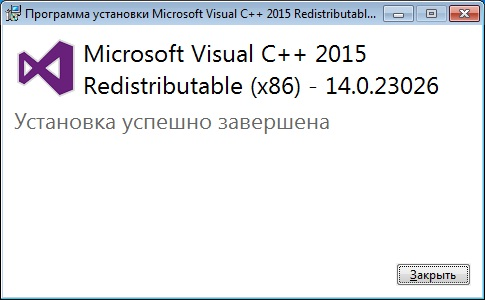

#### Получение и установка пакета VCredist.exe

Перед установкой eVision на Windows 10  необходимо установить пакет Visual C++ для Visual Studio 2015 для корректной работы программы. Перейдите по ссылке [https://www.microsoft.com/ru-ru/download/details.aspx?id=48145](https://www.microsoft.com/ru-ru/download/details.aspx?id=48145), нажмите "*Cкачать*".

Затем в зависимости от Вашей системы отметьте 32 или 64 битную версию галочкой, нажмите "*Next*".   

Запустите скачанный файл vcredist.exe, в итоге откроется окно, в котором нам необходимо ознакомиться и согласиться с условиями лицензионного соглашения и затем нажать "*Установить*".  

Начался процесс установки.  

По окончанию установки появится соответствующее окно о окончании установки. Нажмите “Закрыть”.  

Теперь можно продолжить установку программы **eVision**.  

#### Установка eVision для Windows

Скачать установочный файл можно на сайте www.evision.tech в разделе Evision. Или по этой ссылке [https://api.evision.tech/distr/eVision.3.4.0_setup.exe](https://api.evision.tech/distr/eVision.3.4.0_setup.exe)  

.png)

Запустите установочный файл, следуйте указаниям мастера установки, при необходимости меняйте язык установки и папку, в которую будет установлен **eVision** на вашем компьютере. 

.png)

.png)

.png)

.png)

.png)

.png)

.png)

.png)

После завершения установки **eVision** будет готов к запуску.

#### Установка eVision для Ubuntu

Для начала работы **eVision** необходимо установить программное обеспечение для быстрого развертывания приложений Docker и Docker-compose для Ubuntu. Подробную инструкцию, как это сделать можно прочитать на сайтах:
<https://totaku.ru/ustanovka-docker-i-docker-compose-v-ubuntu-18-04>

<https://losst.ru/ustanovka-docker-na-ubuntu-16-04>

Инструкция с некоторыми полезными командами Docker:
<https://www.digitalocean.com/community/tutorials/docker-ubuntu-18-04-1-ru>

После установки Docker, скачиваем конфигурационный YML файл текущей версии **eVision** по ссылке: [https://api.evision.tech/distr/docker-compose.yml](https://api.evision.tech/distr/docker-compose.yml).

Для загрузки контейнера **eVision** в папке с конфигурационным файлом в командной строке необходимо выполнить команду:

*docker-compose pull*

Для запуска контейнера **eVision** в папке с конфигурационным файлом в командной строке необходимо выполнить команду:

*docker-compose up*

После запуска данной команды в окне терминала появится логирование событий и состояния **eVision.**. Контейнер будет запущен.