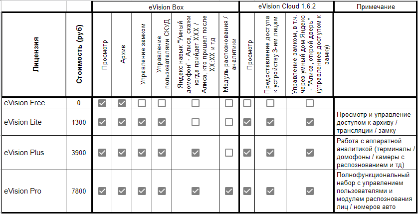

Начиная с версии 3.6 в eVision реализованы следующие типы лицензий:

- Free - бесплатная лицензия, включающая в себя просмотр видеопотока с камер и запись видеоархива  
- Lite - лицензия, включающая в себя просмотр видеопотока, запись видеоархива, управление замком, а также управление пользователями СКУД  
- Plus - лицензия, включающая в себя просмотр видеопотока, запись видеоархива, управление замком, управление пользователями СКУД, аппаратная видеоаналитика, на устройствах Beward TFR, Яндекс навый "Умный домофон"*  
- Pro - лицензия, включающая в себя просмотр видеопотока, запись видеоархива, управление замком, управление пользователями СКУД, аппаратная видеоаналитика, на устройствах Beward TFR, Яндекс навый "Умный домофон"**, а также видеоаналитика eVision  

*- В Яндекс навыке "Умный домофон" доступны команды: Алиса, скажи когда придет ###Имя пользователя###; Алиса, кто пришел (в том числе с указанием времени)  

**- В Яндекс навыке "Умный домофон" доступны команды: Алиса, открой дверь; Алиса, скажи когда придет ###Имя пользователя###; Алиса, кто пришел (в том числе с указанием времени)  

Сравнение лицензий:  

