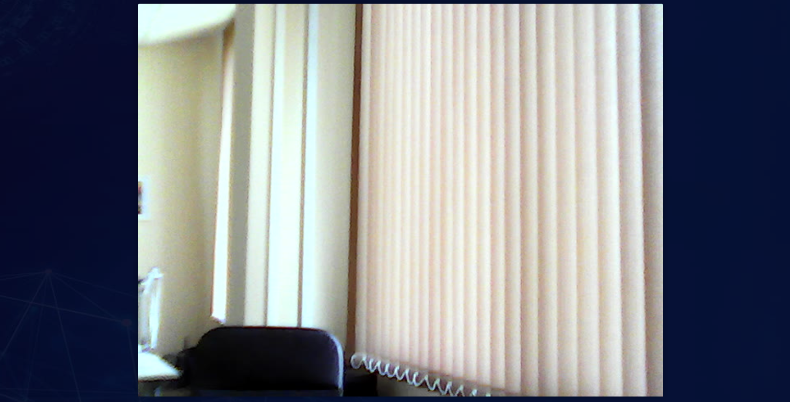

В **eVision** для Windows доступно использование одной веб-камеры. Для того, чтобы использовать веб камеру:

- Подключите веб-камеру к компьютеру, с установленным **eVision**. При необходимости установите драйвера для веб-камеры.
- Откройте **eVision**, нажмите кнопку **Добавить устройство** 

.

- В списке **Устройство** выберите пункт **Веб-камера**.

- В появившемся поле **Имя устройства** введите наименование для устройства.

 

- Нажмите кнопку **Добавить**

Откроется трансляция с веб-камеры:

 