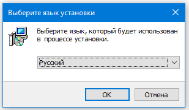
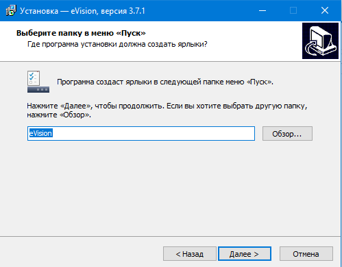
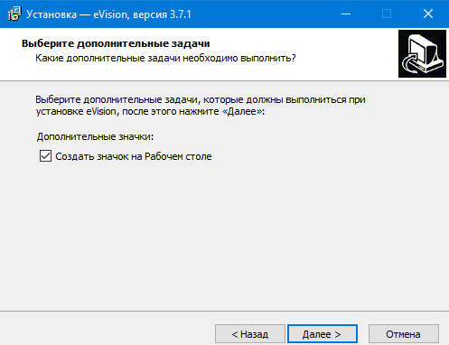
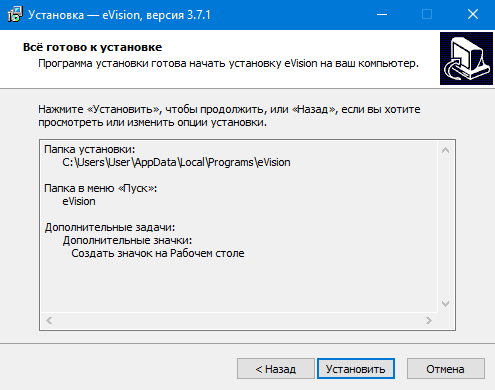
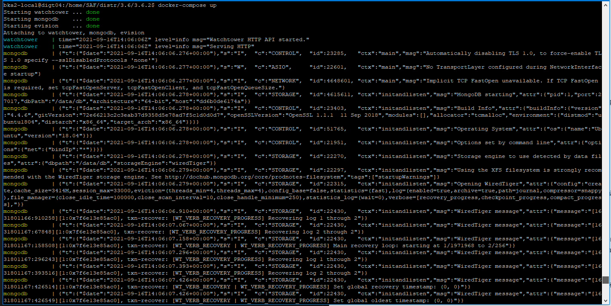

#### Установка eVision для Windows

Начиная с версии 3.6 в установочном пакете eVision содержится пакет Visual C++. Скачать установочный файл можно на сайте www.evision.tech в разделе Evision. Или по этой ссылке [https://api.evision.tech/distr/eVision.3.6.2_setup.exe](https://api.evision.tech/distr/eVision.3.6.2_setup.exe)  

Запустите установочный файл, следуйте указаниям мастера установки, при необходимости меняйте язык установки и папку, в которую будет установлен **eVision** на вашем компьютере. 

Нажмите **ОК**

Нажмите **Далее**

Нажмите **Далее**

Нажмите **Далее**

Нажмите **Установить**

После завершения установки, **eVision** будет готов к запуску.

#### Установка eVision для Ubuntu

Для начала работы **eVision** необходимо установить программное обеспечение для быстрого развертывания приложений Docker и Docker-compose для Ubuntu. Подробную инструкцию, как это сделать можно прочитать на сайтах:

1. <https://totaku.ru/ustanovka-docker-i-docker-compose-v-ubuntu-18-04>

2. <https://losst.ru/ustanovka-docker-na-ubuntu-16-04>

А также вы можете прочитать инструкция с некоторыми полезными командами для Docker:

1. <https://www.digitalocean.com/community/tutorials/docker-ubuntu-18-04-1-ru>

После установки Docker и Docker-Compose, скачиваем конфигурационный YML файл текущей версии **eVision** с официального сайта, по ссылке: 

[https://api.evision.tech/distr/docker-compose.yml](https://api.evision.tech/distr/docker-compose.yml)

Для загрузки контейнера **eVision** в папке с конфигурационным файлом в командной строке необходимо выполнить команду, скорее всего понадобяться права администратора:

*docker-compose pull*

Для запуска контейнера **eVision** в папке с конфигурационным файлом в командной строке необходимо выполнить команду, без прав администратора:

*docker-compose up*

После выполенения данной команды контейнер будет запущен и в окне терминала появится логирование событий и состояния **eVision.**

