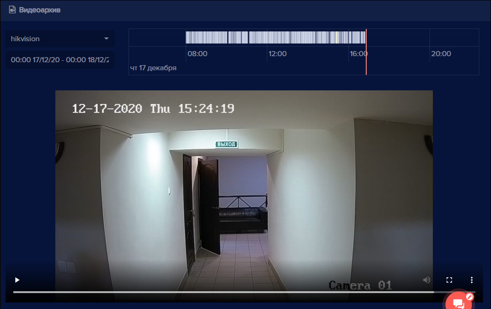
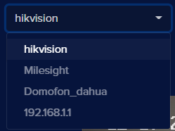
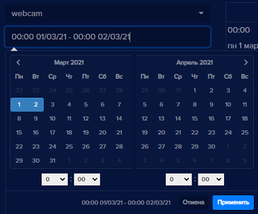
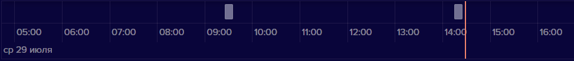
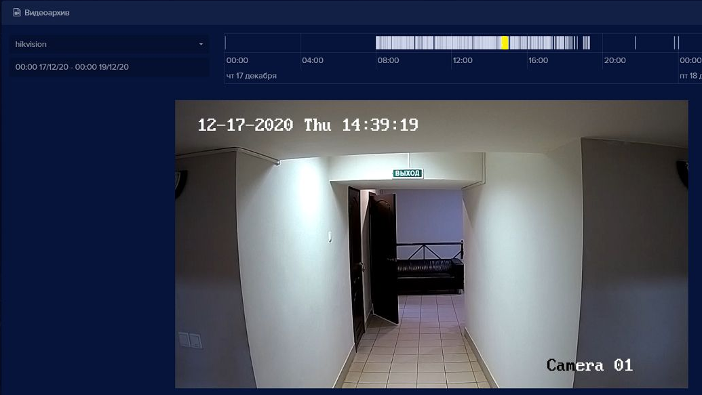
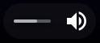

Вкладка **Видеоархив** предназначена для просмотра файлов из видеоархива. 

Для  просмотра файлов:

- В левом боковом меню перейдите на вкладку **Видеоархив** 
  

- Выберите устройство из списка

- Выберите из выпадающего календаря или введите вручную период времени, за который нужно отобразить видеоархив. **Внимание**: период хранения видео зависит от настроек, по умолчанию 3 суток.

- В шкале времени выберите видеоролик,  который необходимо воспроизвести (продолжительность одного ролика 10 минут)

Отобразиться запись видеоархива за выбранное время. Активная часть шкалы подсветится желтым

Для видео доступны операции управления:

||воспроизведение видео|
||остановка воспроизведения|
||настройка звука. Имеет смысл только в случае, если видеоустройство оборудовано микрофоном и записывало звук|
| |полноэкранное видео или  обычное|
||меню расширенных настроек содержит пункты **Скачать** и **Картинка в картинке**|
||скачивание выбранного видео|
||просмотр выбранного видео в отдельном окне|