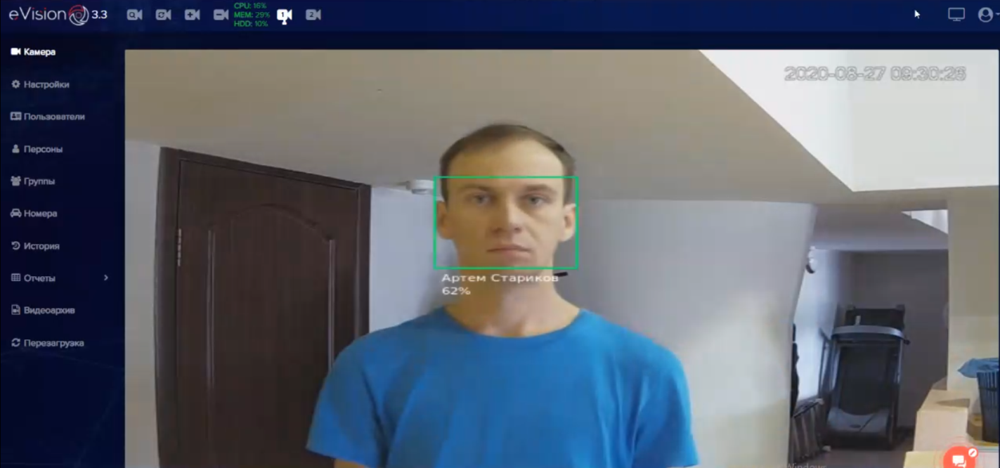
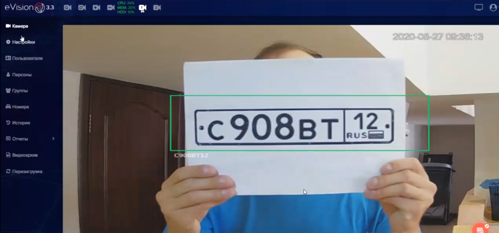

Когда добавлено устройство, введен лицензионный ключ, лицензия активна и включена видеоаналитика, можно проверить распознавание объектов.

##### Распознавание лиц

Когда человек появляется в зоне распознавания, на видеопотоке при распознавании появляется цветная рамка с именем или идентификатором пользователя:

##### Распознавание автомобильных номеров

Когда автомобильный номер машины появляется в зоне распознавания, на видеопотоке при распознавании появляется цветная рамка с идентификатором номера:

