Почтовые уведомления на с данными из отчета **Рабочее время** можно получать на ваш адрес электронной почты. Для того, чтобы включить почтовые уведомления:

- Добавьте камеру в eVision

**Важно:** Камера должна быть установлена так, чтобы в ее обзор попала территория, в которой происходит движение людей. Камера может быть расположена на стене, вверху или на потолке.  

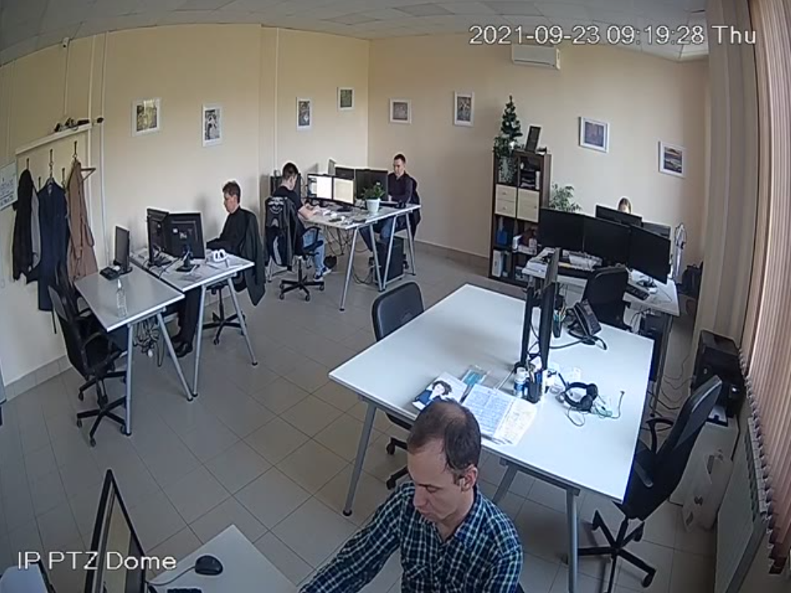

- В настройках камеры в **eVision**, в блоке **Активация** активируйте лицензионный ключ, переключатель **Активация** должен быть включен

**Важно:** Для работы видеоаналитики необходима лицензия Pro.

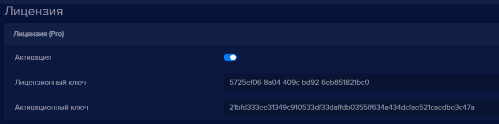

- В настройках камеры в **eVision**, в блоке **Видеоаналитика**, выберите Детектор объектов **Распознавание персон**

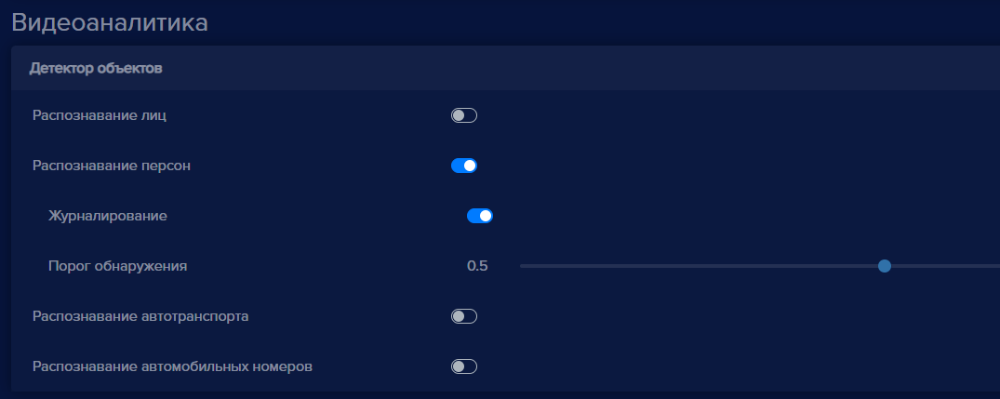

- Сохраните настройки устройства

Октроется окно трансляции камеры, в левом верхнем углу появятся распозанные персоны с идентификаторами

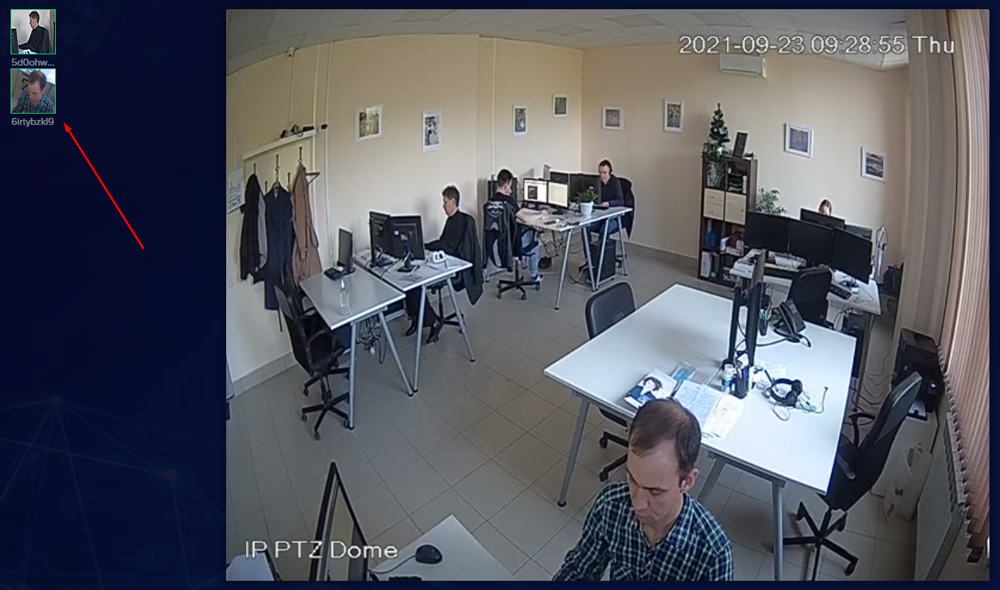

- В настройках камеры в **eVision**, в блоке **События** найдите пункт **Почтовые уведомления**

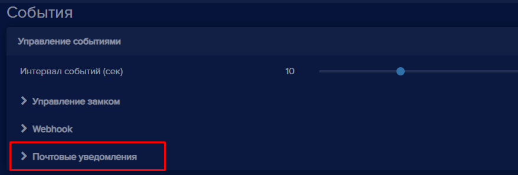

Откроется форма настройки параметров отправки.

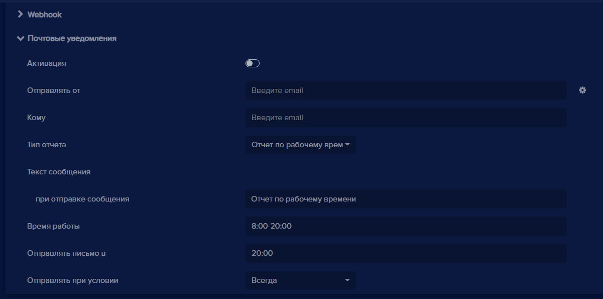

- Переключатель **Активация** переведите в рабочее состояние
- Нажмите на кнопку ввода параметров отправки отчета

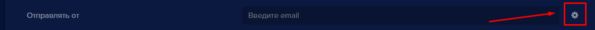

Откроется окно **Настройка почтового сервера**

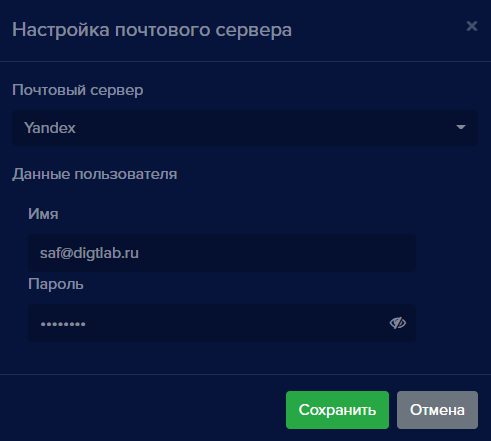

- Выберите Почтовый сервер. В **eVision** поддерживается почтовый сервер Yandex, Google, а также ваш локальный почтовый сервер.

- В поле **Имя** введите имя учетной записи, с которой будут отправляться уведомления
- В поле **Пароль** введите пароль учетной записи, с которой будут отправляться уведомления
- Нажмите кнопку **Сохранить**, окно **Настройка почтового сервера** закроется, в поле **Отправлять от** будет прописано имя учетной записи, которая была указана в настройках почтового сервера
- В поле **Кому** введите адрес электронной почты, на которую следует отправлять почтовые уведомления
- В поле **Тип отчета** выберите **Отчет по рабочему времени**
- В блоке **Текст сообщения** вы можете указать заголовок письма, по умолчанию указано **Отчет по рабочему времени**, при необходимости введите другое название отчета
- В поле **Время работы** укажите часы рабочего времени точки, оно будет действовать каждый день недели, по умолчанию указано с 8:00 до 20:00
- В поле **Отправлять письмо в** выберите время, в которое необходимо отправлять сформированный отчет. Обратите внимание, что лучше выбрать время отправки не раньше времени окончания времени работы точки, по умолчанию указано время 20:00
- В поле **Отправлять при условии** выберите подходящее условие для отправки отчета, **Всегда**, **Время меньше установленного**, **Время отличается от установленного**, по умолчанию выбрано **Всегда**
- Сохраните настройки

Если все параметры введены правильно, то в указанное время отправки письма на электронный адрес, указанный в поле **Кому** придет письмо, содержащее отчет:

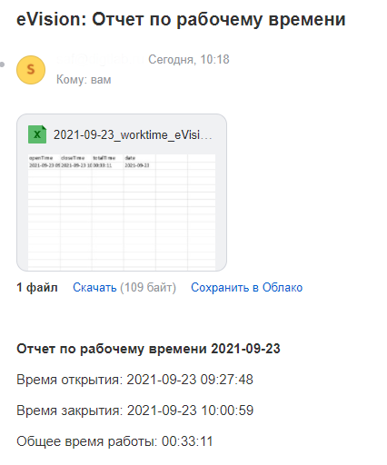

**Дополнительная настройка почтового сервера Yandex**

Для того чтобы, использовать почтовый адрес **Yandex**, в качестве отправки отчета рабочего времени, необходимо выполнить следующие действия:

- нажмите на кнопку **Профиля** и перейдите во вкладку **Управление аккаунтом**;

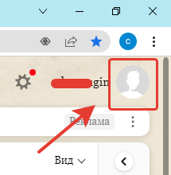

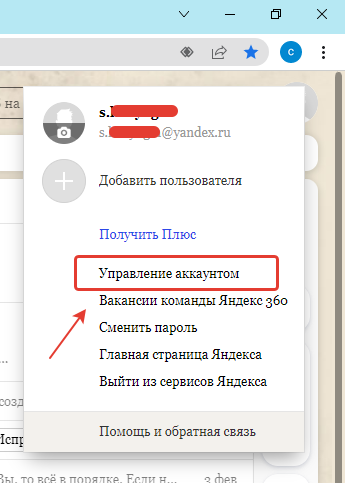

- в разделе **Пароли и авторизация** перейдите в **Пароли приложений** и нажмите на кнопку **Создать новый пароль**;

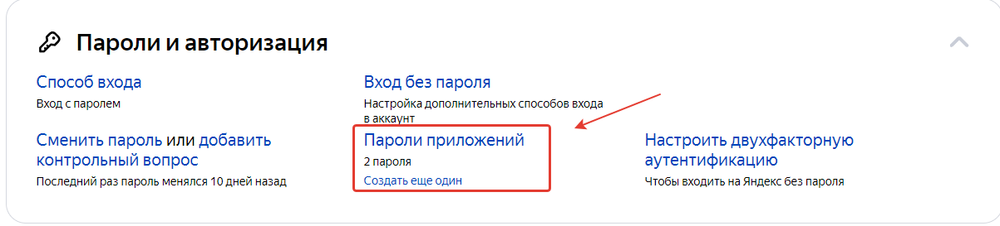

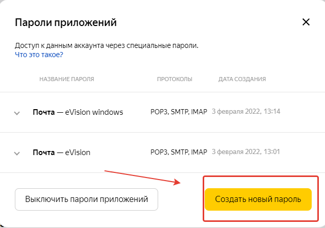

- выберите тип приложения **Почта**, затем введите **Название пароля для доступа к почте** и нажмите на кнопку **Создать**;

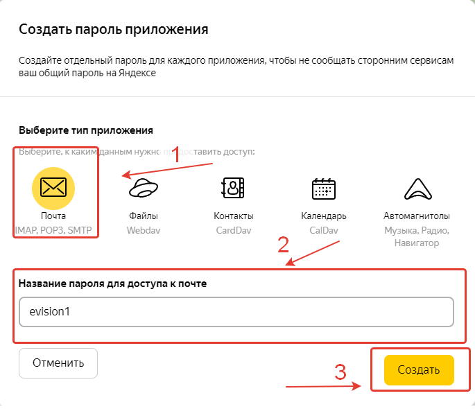

- нажмите на кнопку **Скопировать**;
  
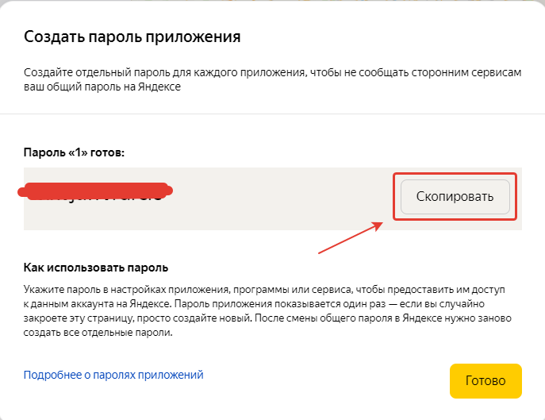

- перейдите в eVision в **Настройки почтового сервера** и скопированный **Пароль приложения** вставьте в поле **Пароль**;

- Вернитесь на почтовый адрес и перейдите в **Настройки почты** раздел **Прочие**;

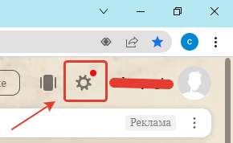

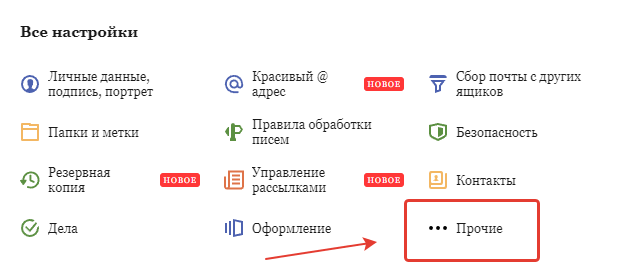

- выберите **Почтовые программы**;
  
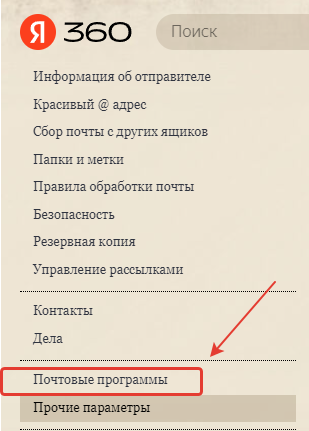

- Выберите **С сервера pop.yandex.ru по протоколу POP3** и нажмите кнопку **Сохранить изменения**.

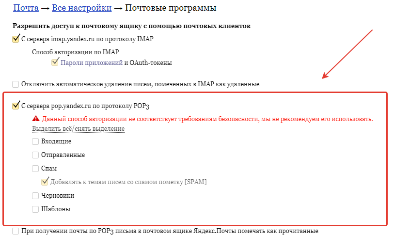

**Дополнительная настройка почтового сервера Gmail**

Для того чтобы,  использовать почтовый адрес **Gmail**, в качестве отправки отчета рабочего времени, необходимо выполнить следующие действия:

- нажмите на кнопку **Профиля** и перейдите во вкладку **Управление аккаунтом Google**;

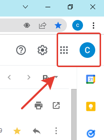

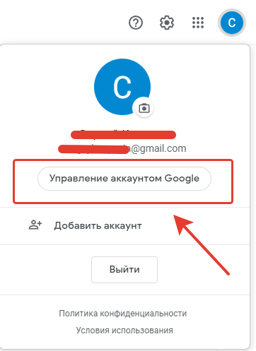

- выберите раздел **Безопасность**;
  
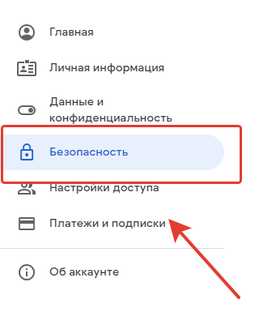

- в разделе **Вход в аккаунт Google** перейдите в **Пароли приложений**;

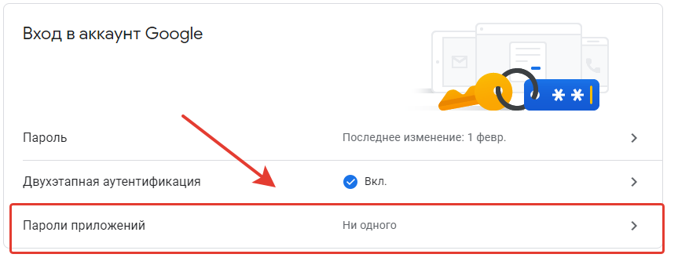

- во вкладке **Приложение** выберите **Почта**;

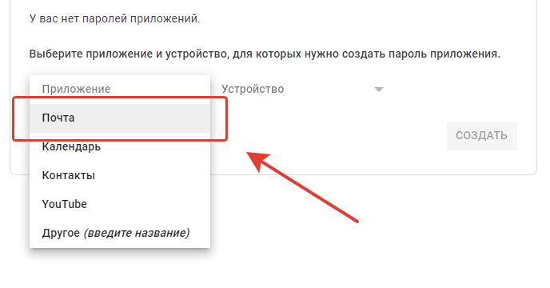

- во вкладке **Устройство** выберите **Компьютер windows** или **Другое**, введя название устройства **Ubuntu**;
  
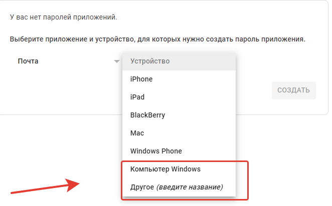

- нажмите на кнопку  **Создать** и скопируйте **Пароль приложения**;

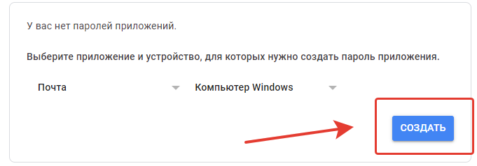

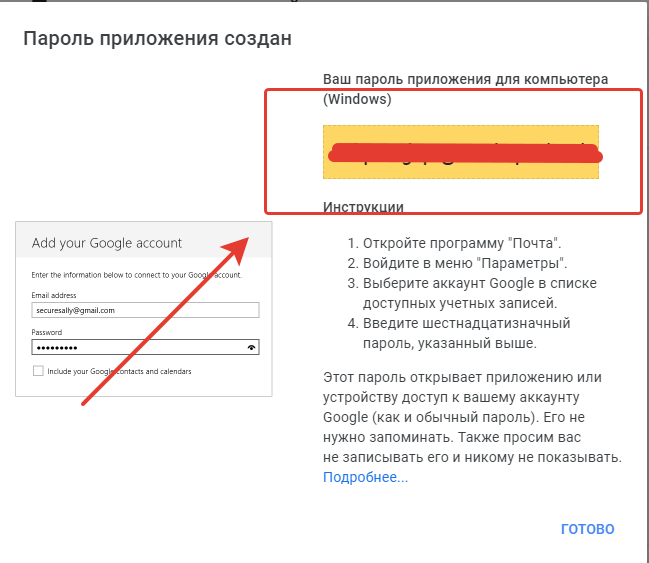

- перейдите в eVision в **Настройки почтового сервера** и скопированный **Пароль приложения** вставьте в поле **Пароль**.

