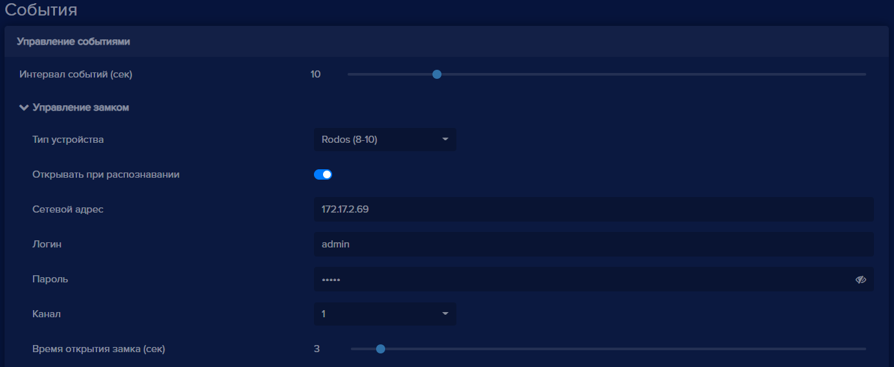
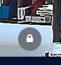
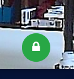
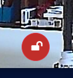

В программе **eVision** вы можете добавить исполнительное устройство для осуществления контроля и привязать его к существующей камере для этого:
- Выберите из камеру для которой необходимо добавить устройство контроля.

- Перейдите в **Настройки**, найдите блок **События**, **Управление событиями**, раскройте пункт **Управление замком**.

- Выберите тип устройства из списка

*Для примера будет использоваться Rodos 10*

    

- Введите в поле **Сетевой адрес** IP адрес устройства в формате *192.168.0.0*
- Введите в поле **Логин** - логин для доступа на устройство
- Введите в поле **Пароль** - пароль для доступа на устройство
- Выберите в списке **Канал** номер канала 1 - 4
- Измените время на которое реле будет открыто в пункте **Время открытия замка**, по умолчанию время выбрано 3 секунды
- Сохраните настройки

**Важно:** Пункт **Открывать при распознавании** необходим для управления срабатыванием реле исполнительного устройства (замка), при его отключении распознавание будет продолжать работать, но сигнал на открытие замка отправляться не будет.  

После сохранения настроек в окне трансляции появится неактивная кнопка открытия замка, серого цвета: 

    

Когда в настройках устройства введена лицензия и она активирована, то кнопка открытия замка будет находиться в активном, рабочем состоянии, зеленого цвета: 

   

При нажатии на кнопку происходит срабатывание реле запирающего устройства: 

   

**Важно:** Для устройств Beward (B серия, DS серия), Beward (B2230-LP), Beward (DKS15120), Beward (DKS15122), Beward (DS06M), Beward (TFR), Dahua (VTO2101E-P), Nateks (FG-ACE-VC-2HD) блок настроек для встроенного реле заполняется автоматически. При необходимости настройки можно менять.  