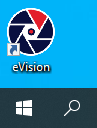
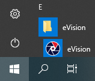

#### Запуск eVision для Windows

Существует несколько вариантов запуска приложения из ярлыка **eVision**, который находится:
- на Рабочем столе: 

- в меню Пуск: 

После запуска откроется окно авторизации:

Введите логин и пароль пользователя и нажмите кнопку **Войти**. По умолчанию логин и пароль пользователя с правами администратора: admin/admin.

**!** Для безопасности стандартные логин и пароль администратора рекомендуется поменять. Восстановление утерянных логина и пароля учетной записи администратора  невозможно, сохраните их в безопасном месте.

#### Запуск eVision для Ubuntu

После запуска контейнера **eVision** откройте браузер и введите в адресной строке localhost с указанием номера порта 4000:

*localhost:4000*

Откроется окно авторизации. По умолчанию логин и пароль пользователя с правами администратора: admin/admin.

Если вы запустили eVision на сервере, то, находясь в одном сегменте локальной сети, в интерфейс eVision можно зайти с другого компьютера, используя IP-адрес компьютера и номер порта 4000, например:  

*192.168.0.3:4000*