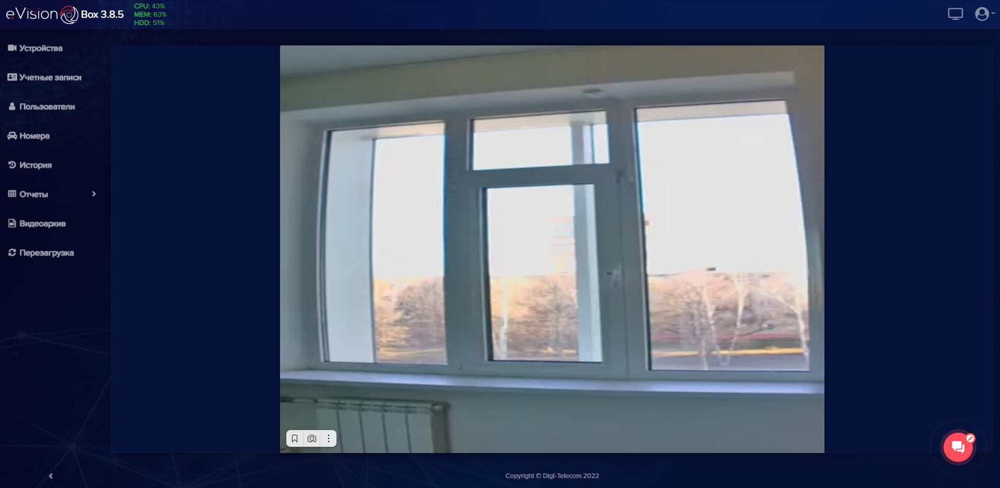
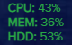

В верхней части экрана расположены:

|Элемент интерфейса|Описание|
| :- | :- |
||**Индикаторы ресурсов системы** служат для отслеживания использования процессора, оперативной памяти и жесткого диска.|
||Кнопка **Видеостена** позволяет одновременно отображать активные камеры на экране.|
||Кнопка вызова меню общих настроек **eVision**.|

В меню общих настроек находятся:

|Элемент интерфейса|Описание|
| :- | :- |
||Кнопка для перехода в меню настроек.|
||Кнопка изменения цветовой схемы.|
||Кнопка для смены языка интерфейса **eVision**.|
||Кнопка вызова окна с данными о программе.|
||Кнопка выхода из учетной записи пользователя.|

В левой части экрана расположены кнопки и вкладки:

|Элемент интерфейса|Описание|
| :- | :- |
||На вкладке **Устройства** отображается список подключенных устройств и кнопки для работы с каждым из подключенных устройств. Также в этой вкладке находятся кнопки для добавления новых устройств.|
||На вкладке **Учетные записи** администратором создается база учетных записей пользователей **eVision**.|
||На вкладке **Пользователи** создается база сотрудников с фотографиями и настраивается доступ для подключенных устройств.|
||На вкладке **Номера** создается база автомобильных номеров и настраивается доступ автомобилей для подключенных устройств.|
||На вкладке **История** содержится база распознанных объектов, лиц, автомобилей и автомобильных номеров. Доступны действия по выбору источника, фильтры, экспорт данных.|
||Вкладка **Отчеты** позволяет просматривать статистику по распознанным объектам.|
||На вкладке **Видеоархив** можно просматривать записи с видеоустройств.|
||Кнопка для перезапуска **eVision**.|

В нижней части экрана находится:

|Элемент интерфейса|Описание|
| :- | :- |
||Виджет **Открытые линии** для связи с технической поддержкой.|
||Кнопка для сворачивания панели вкладок.|