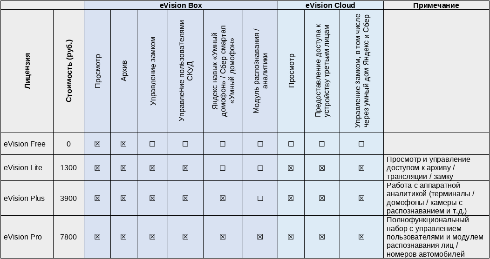

### Типы лицензий

Начиная с версии 3.6 в eVision реализованы следующие типы лицензий:

- [Free](https://api.evision.tech/distr/eVision_setup.exe) - бесплатная лицензия, включающая в себя просмотр видеопотока с камер и запись видеоархива. 
- [Lite](https://cryptostore.ru/catalog/litsenziya-evision-lite) - лицензия, включающая в себя просмотр видеопотока, запись видеоархива, управление замком, а также управление пользователями СКУД. 
- [Plus](https://cryptostore.ru/catalog/litsenziya-evision-plus) - лицензия, включающая в себя просмотр видеопотока, запись видеоархива, управление замком, управление пользователями СКУД, аппаратную видеоаналитику на устройствах Beward TFR, Яндекс навык "Умный домофон" и Сбер смартап "Умный домофон".  
- [Pro](https://cryptostore.ru/catalog/litsenziya-evision-pro) - лицензия, включающая в себя просмотр видеопотока, запись видеоархива, управление замком, управление пользователями СКУД, аппаратную видеоаналитику на устройствах Beward TFR, Яндекс навык "Умный домофон" и Сбер смартап "Умный домофон", а также видеоаналитику eVision.

В Яндекс навыке "Умный домофон" доступны команды: Алиса, скажи, когда придет "Имя пользователя"; Алиса, кто пришел (в том числе с указанием времени).

В Сбер смартапе "Умный домофон" доступны команды: Сбер, скажи, когда придет "Имя пользователя"; Сбер, кто пришел (в том числе с указанием времени); Сбер, покажи камеру (вывод изображения с камеры на устройства Сбера).

Сравнение лицензий:

