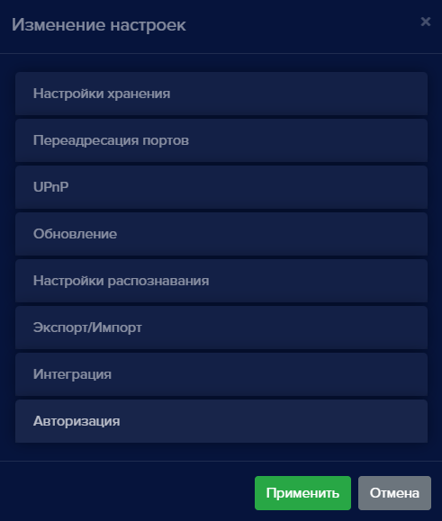
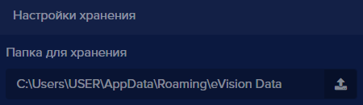
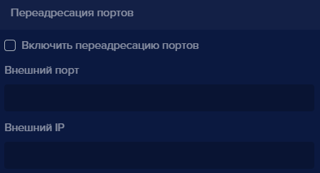
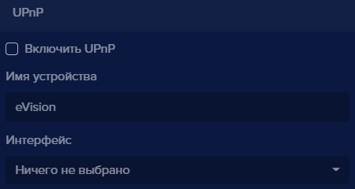

Меню общих настроек содержит:
 - настройки времени хранения записей истории и видеоархива; 
 - настройки переадресации портов;
 - настройки UPnP протокола; 
 - обновление **eVision**;
 - настройки распознавания; 
 - экспорт и импорт настроек, устройств, пользователей и номеров;
 - кнопку включения интеграции с **eVision Server**;
 - настройки авторизации.

Нажмите кнопку общих настроек, выберите пункт **Настройки**. Откроется меню настроек: 

#### Настройки хранения

**Настройки хранения** позволяют менять время хранения файлов в видеоархиве и время хранения записей в истории. По умолчанию видеоархив хранится 3 суток, записи в истории хранятся 90 суток.

В версии для Windows есть дополнительная возможность менять место хранения базы пользователей, автомобильных номеров, а также видеоархива и архива истории. Здесь вы можете указать путь до необходимой вам папки:  

По умолчанию указан путь: C:\Users\ИМЯ ПОЛЬЗОВАТЕЛЯ\AppData\Roaming\eVision Data

#### Переадресация портов

**Переадресация портов** позволяет создать подключение к серверу **eVision** с внешних IP адресов через интернет. В поле **Внешний порт** указывается номер порта, на который необходимо включить переадресацию. Диапазон допустимых портов от 1024 до 65535. Поле **Внешний IP** заполняется автоматически после сохранения настроек и после проверки локальной сети. Если маршрутизатор локальной сети позволяет пробросить порт, то в поле **Внешний IP** появляется внешний IP адрес. Из сети интернет будет доступен интерфейс **eVision** с внешним IP и указанным портом.

**!** Если после применения настройки и перезагрузки системы в поле **Внешний IP** не отобразится внешний адрес роутера, то маршрутизатор локальной сети не позволит создать разрешающее правило. Для этого необходимо обратиться к администратору или службе поддержки производителя маршрутизатора.

#### UPnP
Настройка **UPnP** позволяет включить доступ к интерфейсу **eVision** в локальной сети по протоколу UPnP. При включении **UPnP** в локальной сети появляется новое устройство. При запуске этого устройства будет открыт в браузере интерфейс **eVision**. В поле **Имя устройства** прописывается название, с которым в локальной сети будет определено новое устройство. В поле **Интерфейс** выбирается IP адрес из настроек сетевых адаптеров компьютера, на котором установлен **eVision**.

#### Обновление

**Обновление** позволяет проверить и установить новую версию **eVision**.

#### Настройки распознавания

**Настройки распознавания** позволяют менять точность распознавания лиц. По умолчанию точность распознавания - 50%. 

#### Экспорт/импорт
Данный раздел позволяет выгрузить и загрузить настройки **eVision**, устройства и их настройки, базу пользователей, персон и автомобильных номеров.

#### Интеграция
Данный раздел позволяет включить синхронизацию с **eVision Server**.

#### Авторизация
Этот раздел позволяет авторизоваться через протоколы OAuth и LDAP.

