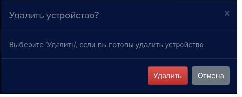

#### Добавление устройства вручную

Для добавления нового видеоустройства необходимо иметь следующую информацию: IP адрес устройства, логин и пароль для подключения. IP-адрес, логин и пароль можно получить у администратора вашей сети или в документации к устройству.

Чтобы добавить новое устройство, перейдите на вкладку **Устройства** в левом меню. Откроется окно для взаимодействия с устройствами.

Нажмите кнопку добавления новых устройств: 

 

Откроется окно **Добавить устройство** с выпадающим списком **Устройство**.

Для устройств в данном списке в **eVision** имеются предустановленные параметры для получения видеопотока и работы замка, которые не придется настраивать вручную.

*Для примера будет использован видеодомофон Beward DS06M.* 

- Выберите в списке **Устройство** пункт **Beward (DS06M)**, откроется окно параметров устройства.
- В поле **Имя устройства** введите наименование нового устройства. Для ввода допускаются буквы и цифры. Укажите уникальное имя, означающее назначение или местоположение устройства, например *Вход, Домофон, Камера на въезде.*
- В поле **IP-адрес устройства** введите корректный IP адрес видеоустройства.
- В поле **Логин доступа** введите логин для доступа на устройство.
- В поле **Пароль доступа** введите пароль для доступа на устройство.
- В поле **Режим видеоаналитики (необходима лицензия)** выберите **Лицо**, если видеоустройство будет использоваться для распознавания лиц людей, или **Автомобильный номер**, если видеоустройство предназначено для распознавания автомобильных номеров.
- Нажмите кнопку **Добавить**, откроется окно, в котором транслируется видео с данного устройства.
  

При подключении видеодомофонов появляется  кнопка **Открыть замок**:

 
 
При нажатии на нее срабатывает контроллер замка. Данная кнопка применяется для открытия двери вручную.

**!** Если в данном списке нет устройства, которое используется у вас, то в списке **Устройство** выберите пункт **Другие устройства**, он находится в конце списка:

#### Сканер устройств
Для автоматического поиска устройств в локальной сети используйте встроенный способ. Сканер устройств работает по протоколу UPnP. В некоторых случаях это помогает сократить время на поиск нужного устройства. Однако следует учесть, что данный функционал может зависеть от настроек локальной сети, а также могут быть некоторые ограничения использования данного функционала на Windows. Веб-камера сканером устройств не определяется.

Для того, чтобы запустить поиск устройств в локальной сети по протоколу UPNP:

- Нажмите кнопку **Сканер устройств** на панели устройств:

   
 
 Откроется окно сканера устройств.
 

- Нажмите кнопку **Сканировать**

Откроется окно результатов сканирования. В случае, если видеоустройства в сети не обнаружены, то окно выглядит так:

В случае если видеоустройства в сети найдены, то окно будет выглядеть так: 

- В выпадающем списке выберите нужное устройство. Наименование устройства зависит от настроек самого устройства. В вашей сети устройства могут быть названы иначе.  
  
- Выберите устройство, откроется окно настроек:

Выберите модель устройства из выпадающего списка. Если ваше устройство отсутствует в списке, то оно не поддерживается. При подключении неподдерживаемой модели будут выставлены стандартные настройки. Вы сможете исправить их в дальнейшем вручную в настройках самого устройства.  

- Введите имя устройства, оно должно быть уникальным. Автоматически имя устройства берется из результатов сканера устройства.
- Поле **IP-адрес** заполнено автоматически.
- В поле **Логин доступа** введите логин для доступа на устройство.
- В поле **Пароль доступа** введите пароль для доступа на устройство.
- В поле **Режим видеоаналитики (необходима лицензия)** выберите **Лицо,** если видеоустройство будет использоваться для распознавания лиц людей, или выберите **Автомобильные номера,** если видеоустройство предназначено для распознавания автомобильных номеров, или **Автомобиль**.Также можно задать несколько типов детекторов одновременно.
- Нажмите кнопку **Добавить**. Откроется окно, в котором транслируется видео с данного устройства.

#### Перезагрузить устройство
Для того, чтобы перезагрузить трансляцию с видеоустройства:

- Нажмите кнопку **Перезагрузить устройство**:

 

Откроется окно подтверждения перезагрузки устройства.

- Нажмите на кнопку **ОК,** трансляция перезапустится и откроется окно, в котором транслируется видео с данного устройства.

**!** При перезапуске трансляции само устройство не перезагружается.

#### Удалить устройство

Для того, чтобы удалить устройство, нажмите кнопку с изображением корзины: 

 

Откроется окно подтверждения удаления устройства. 

- Если на устройстве ранее не была активирована лицензия, то окно удаления устройства будет выглядеть следующим образом:

- Если на устройстве была активирована лицензия, то вам будет предложено сохранить лицензионный и активационный ключи. При сохранении ключей будет создан текстовый файл "keys.txt", который будет сохранен на вашем ПК (по умолчанию его можно найти в разделе "Загрузки"). 

После сохранения ключей можете удалить устройство. Выберите **Удалить**. Устройство будет удалено из **eVision**.

**!** При удалении устройства распознанные лица с него сохраняются в истории.

