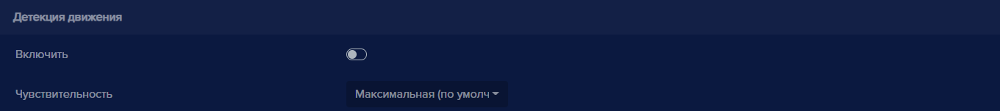
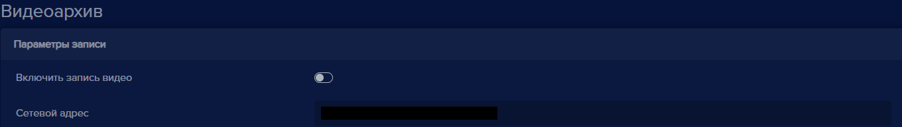
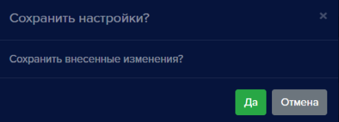

У каждого добавленного устройства есть кнопка редактирования , при нажатии которой открывается раздел настроек устройства. 

Данный раздел предназначен для ввода лицензионного ключа, настройки параметров видеопотока, настройки видеоаналитики, управления замком, настройки видеоархива, настройки голосовых уведомлений и оповещений, а также для  активации облачного сервиса для устройства.

По левой стороне открывшегося окна расположены разделы настроек, между которыми вы можете переключаться. При перемотке пунктов настроек вниз разделы по левой стороне будут подсвечиваться в зависимости от того, на каком разделе вы находитесь в данный момент.

В настройках содержатся разделы:

- Лицензия
- Камера
- Видеоархив
- События
- Голосовой сервис
- Видеоаналитика
- Подключение к **eVision Cloud**

### Лицензия
Раздел **Лицензия** необходим для ввода лицензионного ключа. Лицензионный ключ прописывается для каждого устройства. При активации лицензии рядом с заголовком раздела будет прописано, какую версию вы активировали: Lite, Plus, Pro.

### Камера
Раздел **Камера** содержит настройки видеопотока, разрешения, частоты кадров, сервиса получения снимков по FTP и детектора движения.

#### Подключение

Раздел **Подключение** содержит следующие настройки:

Кнопка **Активация** позволяет выключить или включить получение видеопотока с устройства для видеоаналитики.

В поле **Название** указывается наименование устройства.

В поле **Сетевой адрес** указывается путь для получения видеопотока.

Переключатель **Показывать на панели устройств** дает возможность добавить отображение камеры на верхнюю панель,где размещаются индикаторы, для быстрого доступа к устройству.

Поле **Внешний ID** используется для интеграции с другими системами (Sigur).

Поле **Направление** применяется при настройке камер для распознавания номеров: камера размещается на въезде или на выезде.

#### Отображение

Раздел **Отображение** содержит следующие настройки:

В пункте **Разрешение** указывается разрешение, с которым **eVision** получает видеопоток с устройства. Доступные значения: **Original, 320x240, 640x480, 1280x720**. При выборе значения **Original** **eVision** получает видеопоток с разрешением, указанным в настройках самого устройства.

В пункте **Частота кадров** указывается максимальная частота кадров видеопотока. Доступны значения от 1 до 25 кадров в секунду. Регулировка выполняется ползунком по шкале.

В пункте **Протокол** (выбор транспортного протокола) доступны варианты TCP и UDP.

#### Детекция движения

Раздел **Детекция движения** содержит следующие настройки:

Кнопка **Включить** позволяет активировать детектор движения.

В пункте **Чувствительность** указывается уровень чувствительности детектора движения. Доступные значения: **Максимальная, Высокая, Средняя, Низкая, Минимальная**.

### Видеоархив

В разделе **Видеоархив** включается и настраивается путь к видеопотоку, который будет сохраняться на жестком диске. Время хранения видеопотока указывается в меню общих настроек. По умолчанию время хранения видео 30 дней.

Кнопка **Включить запись видео** включает запись видеофайлов на жесткий диск.

В поле **Сетевой адрес** указывается путь для получения видеопотока.

### События

В разделе **События** содержатся настройки исполнительных устройств (замков, сетевых реле), запросов webhook и времени работы исполнительных устройств.

В пункте **Интервал событий (сек)** указывается интервал времени срабатывания замка. 

#### Управление замком

Содержит несколько предустановленных вариантов оборудования различных производителей, включая сетевые реле и видеоустройства с релейными выходами. А также работу сетевого реле можно настроить вручную, используя распространенные параметры.

**Тип устройства** содержит список устройств, для которых в **eVision** сохранены параметры для управления реле различных производителей либо для настройки замка вручную.

**Открывать при распознавании** - пункт, который отвечает за срабатывание замка при распознавании человека с разрешенным доступом.

**Сетевой адрес** - IP адрес устройства.

**Логин** - учетная запись для доступа на устройство.

**Пароль** - пароль учетной записи для доступа на устройство.

После заполнения полей в окне видеопотока появится кнопка **Открыть замок** .

#### Webhook

Раздел для настройки http запросов, которые могут отправляться на указанный адрес сервера при распознавании объекта.

Кнопка **Включить** активирует включение сервиса отправки webhook запросов. 

Поле **Webhook URI** - поле для ввода адреса сервера для приема webhook запросов.

Пункт **Тип запроса** - список для выбора типа запроса: **POST** или **GET**.

**Отправить: Идентификатор объекта, Имя объекта, Идентификатор устройства, Имя устройства, Доступ пользователя** - включает или убирает из запроса выбранную информацию.

#### Почтовые уведомления

Почтовые уведомления предназначены для отправки данных по событию или из отчета "Рабочее время" на адрес электронной почты.

Кнопка **Активация** предназначена для включения сервиса **Почтовые уведомления**.

Пункт **Отправлять от** позволяет настроить почтовый сервер. При нажатии на кнопку настроек  появляется окно:

Поле **Почтовый сервер** позволяет выбрать сервер Gmail, Yandex или задать вручную. При выборе пункта "Задать вручную" добавляются поля для ввода адреса SMTP сервера и порта.

Поля с данными пользователя предназначены для ввода имени пользователя и пароля.

Пункт **Кому** в настройках почтовых уведомлений предназначен для ввода электронного адреса получателя.

Пункт **Тип отчета** позволяет выбрать вид отчета, которые будет отправлен. Есть два варианта: **Событие** и **Отчет по рабочему времени**.

При выборе типа **Событие** добавляется поле для выбора события, по которому будет формироваться уведомление: Детекция объектов, Идентификация объектов, Превышение температуры.

При типе отчета **Отчет по рабочему времени** появляются поля для настройки текста сообщения при отправке (название отчета по рабочему времени), времени работы (период рабочего времени), времени отправки отчета и условий отправки (доступные варианты: Всегда, Время меньше установленного, Время отличается от установленного).

#### График работы управления доступом

Служит для указания интервала рабочего времени исполнительного устройства.

Поле **Рабочее время** указывает диапазон времени для работы видеоаналитики на устройстве.

Переключатель **Отключать на выходные** - пункт для выключения либо включения субботы и воскресенья в рабочие дни недели.

### Голосовой сервис
Раздел, в котором настраиваются голосовые оповещения для оператора.

#### Детектор движения
Раздел, в котором настраиваются оповещения при движении на камере.

В разделе находится переключатель для активации детектора, настройка типа оповещений: **Фраза** - задана фраза "На камере замечено движение!", **Звук** и **Файл пользователя** - добавлена возможность подгружать собственные аудиофайлы.

#### Детектор объектов
Раздел, в котором настраиваются оповещения при распознавании объектов.

В разделе находится переключатель для активации детектора, а также настройки для оповещения при обнаружении распознанных объектов и нераспознанных объектов. Для настроек типа оповещений доступны "Фраза" - задана по умолчанию, **Звук** или **Файл пользователя** - возможность загрузить собственный аудиофайл.

### Видеоаналитика

Раздел **Видеоаналитика** отвечает за настройки распознавания объектов. В данном разделе выбирается режим видеоаналитики устройства. В данный момент доступны четыре режима видеоаналитики: **Распознавание лиц, Распознавание пользователей, Распознавание автотранспорта, Распознавание автомобильных номеров** . Режим может быть выбран при добавлении нового устройства в **eVision**.

У каждого типа распознавания есть отдельный переключатель, позволяющий управлять включением или отключением данного типа распознавания.

#### Распознавание лиц

В блоке **Распознавание лиц** находятся элементы управления, позволяющие настроить основные параметры идентификации. 

Кнопка "Распознавание лиц" позволяет включить или отключить режим распознавания лиц.

**Идентификация лица** активирует процедуру идентификации пользователя с последующей верификацией и записью в Историю.

**Определение возраста** - система попытается определить возраст человека,  чье лицо находится в кадре. 

**Определение пола** - алгоритм распознавания попытается определить пол пользователя.

**Использовать историю** - при включении алгоритм будет использовать распознанные лица пользователя из истории, что повышает точность распознавания.

**Журналирование** - параметр отвечает за сохранение распознавания в истории. Если отключен, то в истории не будут сохранены распознанные объекты.

**Распознавать только на персоне** - пункт связан с распознаванием персон. При включении лицо будет распознано только в том случае, если персона, чье лицо распознается, уже детектирована. Если персона не распознана, то лицо распознаваться не будет.

Блок **Дополнительные настройки** содержит расширенные настройки видеоаналитики:

**Упрощенный детектор** включает упрощенный алгоритм распознавания лиц для снижения нагрузки на процессор.

**Фронтальный детектор** - если детектор включен, то лица, расположенные к камере боком, распознаваться не будут.

**Минимальный размер лица (%)** позволяет выбрать минимальный размер лица при распознавании. В данном случае определяется ширина лица человека относительно ширины кадра. Изменяется от 5 до 85 %. По умолчанию выбрано значение 10%.

**Порог обнаружения** -  статистическая мера вероятности того, что два лица на изображении принадлежат одному и тому же человеку. При анализе чем ниже порог, тем больше шанс обнаружения. 

**Автодобавление нераспознанных лиц** - при включении внесение всех распознанных лиц в базу пользователей. Если алгоритм распознает лицо, оно будет добавлено в таблицу пользователей со случайным именем. Имена можно изменить при редактировании базы пользвателей.

#### Распознавание персон

Кнопка **Распознавание персон** позволяет включить или отключить режим распознавания персон.

**Журналирование** позволяет включить или отключить сохранение истории распознаваний силуэтов.

**Порог обнаружения** позволяет выбрать минимальный порог для распознавания персоны. Изменяется от -1 до 1. По умолчанию выбрано значение 0.5.

#### Распознавание автотранспорта

Кнопка **Распознавание автотранспорта** позволяет включить или отключить режим распознавания автомобилей.

**Журналирование** - распознанный автотранспорт сохраняется в истории.

**Порог обнаружения** позволяет установить минимальный порог для распознавания автотранспорта. Изменяется от -1 до 1. По умолчанию равен 0.9.

#### Распознавание автомобильных номеров

Кнопка **Распознавание автомобильных номеров** позволяет включить или отключить режим распознавания автомобильных номеров.

**Журналирование** - распознанные автомобильные номера сохраняются в истории.

**Распознавать только на автотранспорте** - распознавание автомобильных номеров только на автотранспорте.

**Упрощенный детектор** включает упрощенный алгоритм распознавания автомобильных номеров для снижения нагрузки на процессор.

**Порог обнаружения** позволяет установить минимальный порог для распознавания автомобильных номеров. Изменяется от -1 до 1. По умолчанию равен 0.9.

### Подключение к eVision Cloud

В данном разделе включается или отключается подключение устройства к сервису **eVision.Cloud**.

Кнопка **Активировать** включает возможность транслировать видео с данного устройства в сервис **eVision.Cloud**.

Кнопка **Зарегистрировать устройство** добавляет устройство в облако [cloud.evision.tech](https://cloud.evision.tech/).

После авторизации в облаке и добавлении устройства необходимо сохранить настройки.

### Восстановление настроек по умолчанию

Кнопка **Восстановить настройки по умолчанию** восстанавливает значения полей по умолчанию.

### Сохранение настроек

Кнопка **Сохранить** применяет все изменения настроек устройства.

Кнопка **Отменить**  отменяет сделанные в интерфейсе изменения. 

Если пользователь внес изменения в настройки, но не сохранил результат при переходе в другую часть программы, появится окно с запросом сохранения внесенных изменений. 

