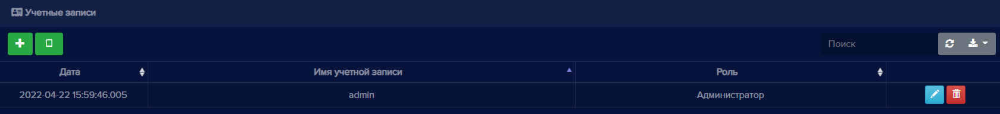
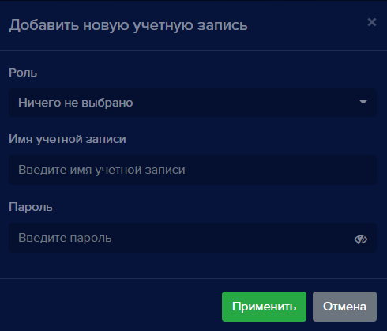
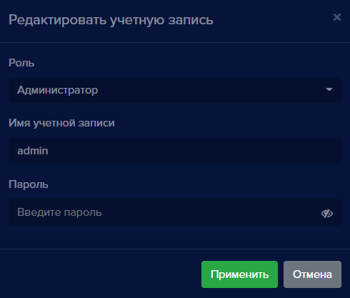
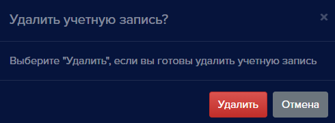
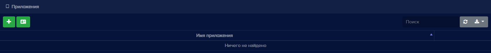
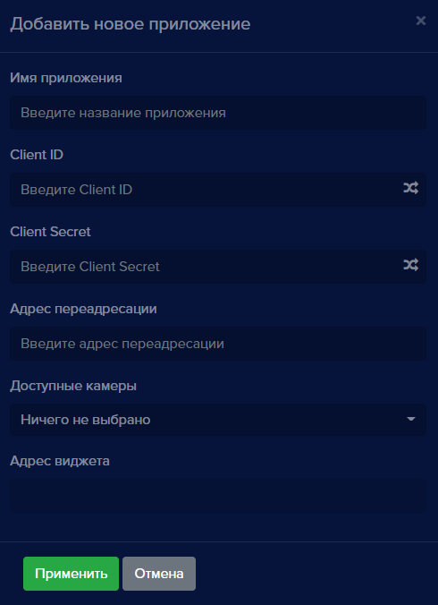

### Учетные записи

Данный раздел предназначен для создания и редактирования учетных записей пользователей **eVision**. Для учетной записи указывается его роль (администратор или оператор).

**Администратор** обладает полным функционалом, включая просмотр видеопотока с устройств, создание и удаление устройств, пользователей, номеров, учетных записей и изменение общих настроек **eVision**.

**Оператор** может только просматривать видеопоток, список пользователей, номеров, групп. 

По умолчанию создана учетная запись с ролью Администратор - **admin**. 

Для учетных записей доступны следующие операции:

- Добавление и выбор роли пользователя
- Редактирование роли пользователя
- Удаление пользователя 
- Поиск
- Обновление списка пользователей
- Экспорт таблицы пользователей в файлы разных форматов

Права пользователей:

|Действия|Администратор|Оператор|
| :- | :- | :- |
|Просмотр видеопотока|Да|Да|
|Просмотр видеоархива|Да|Да |
|Просмотр пользователей|Да|Да|
|Просмотр номеров|Да|Да|
|Просмотр групп|Да|Да|
|Просмотр истории|Да|Да|
|Просмотр отчетов|Да|Да|
|Работа с виджетом открытых линий|Да|Да|
|Добавление и удаление устройств|Да|Нет|
|Добавление и удаление пользователей |Да|Нет|
|Добавление и удаление номеров|Да|Нет|
|Добавление и удаление групп|Да|Нет|
|Добавление и удаление учетных записей|Да|Нет|
|Изменение общих настроек **eVision**|Да|Нет|

Также заложена роль с наименованием **Без роли**, которая понадобится для авторизации в **eVision** через другие oauth провайдеры, например Yandex или Google. Данная роль не имеет функционала, поэтому учетная запись не может авторизоваться в **eVision**. После регистрации такого пользователя администратор назначает ему другую роль: Администратор или Оператор.

Для добавления новой учетной записи необходимо нажать на кнопку добавления:

 

При нажатии откроется окно:

Поле **Роль** позволяет назначить права доступа для учетной записи. Доступны варианты: **Администратор, Оператор, Без роли**.

Поле **Имя учетной записи** предназначено для ввода имени.

Поле **Пароль** дает возможность задать пароль для доступа к учетной записи.

Учетную запись можно редактировать: 

 

и удалить: 

При нажатии кнопки **Редактировать** открывается окно для редактирования учетной записи:

Вы можете изменить роль, имя учетной записи и пароль.

При нажатии кнопки **Удалить** появляется окно удаления учетной записи:

### Приложения

Таблица приложений содержит OAuth 2.0 приложения. Эти приложения предназначены для использования **eVision** в качестве стороннего провайдера авторизации по лицу (лицо пользователя должно быть в базе пользователей **eVision**). При создании приложения генерируется виджет авторизации, который можно использовать для авторизации на различных ресурсах.

Рядом с кнопкой добавления новой учетной записи расположена кнопка **Переключиться на приложения**:

При нажатии на кнопку открывается окно приложений:

Для создания приложения необходимо нажать на кнопку **Добавить приложение**: 

 

Откроется окно добавления нового приложения:

После заполнения всех полей нажмите кнопку **Применить**. Приложение будет создано. 

Чтобы вернуться к учетным записям, необходимо нажать на кнопку **Переключиться на учетные записи**:

