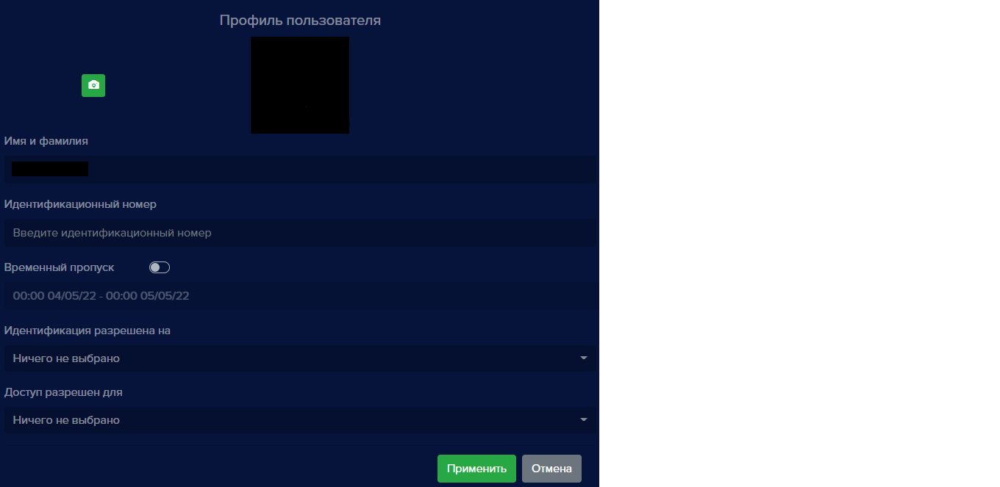

На вкладке **Пользователи** создается база данных пользователей с фотографиями для распознавания, заполняются имена и фамилии, принадлежность группе пользователей, указывается идентификатор сотрудника. 

Для каждого человека настраивается доступ на устройства, добавленные в **eVision**: разрешается  или запрещается человеку проходить в то или иное помещение. У каждого пользователя есть возможность указывать принадлежность к какой либо созданной группе, это могут быть наименования отделов (бухгалтерия, разработка). Пользователей можно вносить в базу вручную по одному или несколько в виде zip-архива. 

Допускается использование фотографий форматов jpeg, jpg, png. Минимальное разрешение фотографии должно быть 300 на 300 пикселей, максимальное следует использовать до 4000 на 4000 пикселей. Используйте фотографии весом не более 2 мегабайт. На фотографии должен быть изображен один человек, анфас. При загрузке фотографии **eVision** вычисляет дескриптор объекта. Лучше сделать фото для добавления в базу пользователей без улыбки, а также следует воздержаться от эмоций, так как при вычислении дескриптор получится некорректным. Каждому пользователю для более точного распознавания можно добавить несколько фото. Очки и борода не являются препятствием для вычисления дескриптора. 

Добавлять людей можно вручную на вкладке **Пользователи**, а также при распознавании. Для этого необходимо включить автодобавление пользователей в разделе **Видеоаналитика** в настройках устройства. На вкладке **История** при включенной видеоаналитике также можно вручную выбирать фото и добавлять пользователей.

Отображение раздела **Пользователи** может быть двух видов:

- в виде дерева:

- в виде таблицы:

По умолчанию пользователи отображаются в виде дерева. Кнопка для переключения режимов отображения находится в правом верхнем углу:

Около каждого пользователя и группы находятся кнопки для редактирования и удаления.

#### Добавление пользователя

Для добавления пользователя нажмите на кнопку **Добавить нового пользователя**:

Откроется окно для добавления пользователей:

В окне содержатся две вкладки: **Один пользователь** и **Множество пользователей**, которые позволяют добавлять одновременно либо одного пользователя, либо сразу несколько.

При выборе вкладки **Один пользователь** находятся следующие поля для заполнения: **Имя и фамилия, Фотография, Идентификационный номер, Временный пропуск, Идентификация разрешена на, Доступ разрешен для**.

В поле **Имя и фамилия** вносятся имя и фамилия пользователя.

В поле **Фотография** загружается фотография пользователя. 

В поле **Идентификационный номер** вводится индивидуальный идентификатор пользователя. Эти данные пригодятся для отчета по рабочему времени.

**!** Можно использовать любые уникальные неповторяющиеся идентификаторы. Если у вас есть система учета сотрудников, то можно использовать эти идентификаторы.

Поле **Временный пропуск** позволяет настроить промежуток времени, в который пользователю будет предоставляться доступ. По истечению срока временного пропуска идентификация человека по лицу проводиться не будет, доступ будет запрещен.

Поле **Идентификация разрешена на** позволяет выбрать устройство, на котором пользователь будет распознаваться.

В поле **Доступ разрешен для** выберите и отметьте устройство(ва), для которых данному пользователю необходимо разрешить доступ.

После нажатия кнопки **Применить** в списке пользователей появится новый пользователь.

#### Добавление множества пользователей

Добавить несколько пользователей с фотографиями возможно, если упаковать фотографии в один zip-архив. Подготовьте фотографии сотрудников. В архиве одному сотруднику должно соответствовать одно фото. Фотографии не должны повторяться. Файлы в архиве должны называться согласно именам и фамилиям пользователей, так как при добавлении пользователей в **eVision** из архива имена сотрудникам будут даны в соответствии с названиями фотографий.

При переходе на вкладку **Множество пользователей** открывается следующее окно:

В поле **ZIP-архив** добавляется архив с фотографиями пользователей с вашего компьютера.

После ожидания появится уведомление с указанием количества успешно добавленных пользователей:

В списке пользователей будут отображены добавленные из архива пользователи. 

**!** Пользователь может не добавиться из архива по причине плохого качества фото: не соответсвует требованиям освещения или разрешения. Необходимо заменить фото на более качественное.

#### Редактирование пользователя

Дле редактирования данных пользователя нажмите кнопку **Редактировать**:

- в отображении дерева кнопка выглядит так: 

- в отображении таблицы кнопка выглядит так: 
  

При нажатии кнопки редактирования в отображении дерева открывается форма для редактирования справа от списка пользователей: 

Вы можете изменить фото, имя и фамилию, идентификационный номер, доступы на устройствах.

При нажатии кнопки редактирования в отображении таблицы открывается окно для редактирования пользователя:

Вы можете изменить имя и фамилию, идентификационный номер, доступы на устройствах.

#### Редактирование множества пользователей

В программе доступно редактирование множества пользователей. Для редактирования доступны следующие параметры:  

- Включить выбранным пользователям доступ на устройстве/устройствах
- Удалить выбранных пользователей

Чтобы редактировать несколько пользователей, необходимо проделать следующие шаги:

- В таблице отметьте галочками нужных пользователей.

- Нажмите **Редактировать пользователей**:
  

- Появится окно редактирования, где вы можете разрешить доступ на одном или нескольких устройства либо удалить выбранных пользователей.

#### Добавление фотографий пользователю

При необходимости каждому пользователю можно добавить несколько фотографий. Добавление дополнительных фото позволит увеличить точность распознавания. Редактировать фотографию можно только в отображении "дерево".

Чтобы добавить фото:

- Выберите пользователя, которому необходимо добавить фото и нажмите на кнопку редактирования. Откроется вкладка справа от списка пользователей **Профиль пользователя**

 

- Нажмите кнопку **Добавить фото**:
  
  
  
- Откроется окно для выбора и загрузки фотографии. Выберете подходящее изображение и добавьте его.

- Чтобы просмотреть все фотографии пользователя, нажимайте на фото. Изображения будут сменяться при каждом клике.

#### Удаление фотографий пользователя

При необходимости удалите неподходящие фото пользователя. Удаляйте некачественные фотографии, смазанные и сделанные при недостаточном освещении. Чтобы удалить фото, нажмите на кнопку удаления фотографии:

#### Удаление пользователя

Чтобы удалить пользователя, нажмите на кнопку удаления:

- отображение "дерево": 

- отображение "таблица": 
  

