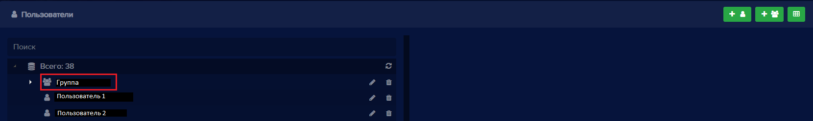
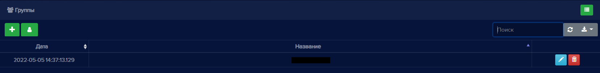
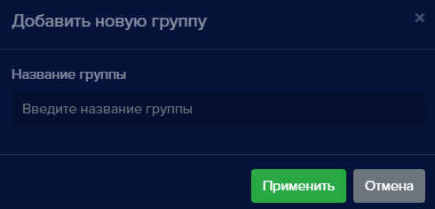
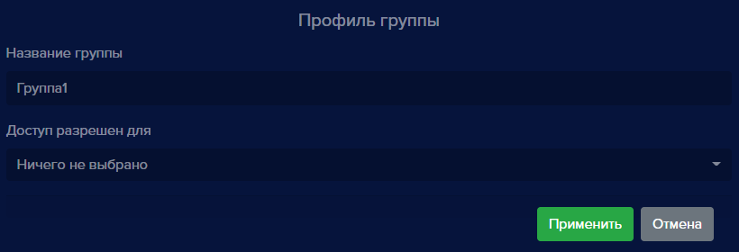
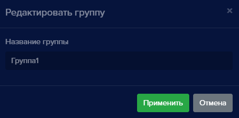

### Группы
Данный раздел предназначен для создания и редактирования групп, в которые можно объединять пользователей. 

Находясь в разделе **Пользователи**, вы можете взаимодействовать с группами: создавать, редактировать, удалять.

В режиме отображения "дерево" вам сразу видна структура групп и пользователей в них:

В режиме отображения "таблица" нажмите на кнопку "Переключиться на группы":

чтобы увидеть список групп:

Данные в таблице можно сортировать по дате и по названию группы.

Для **Групп** доступны следующие операции:
- Добавление группы
- Редактирование названия группы
- Удаление группы. При удалении группы пользователи не удаляются, а исключаются из группы
- Поиск
- Обновление списка групп
- Экспорт таблицы групп в файлы разных форматов

#### Добавление группы

Чтобы добавить группу:

- в режиме отображения "дерево" нажмите на кнопку **Добавить новую группу**:

- в режиме отображения "таблица": переключитесь на **Группы** и нажмите кнопку **Добавить новую группу**:

Откроется окно добавления новой группы:

Введите название группы и нажмите кнопку **Применить**. Группа появится в списке групп.

Чтобы добавить пользователей в группу, в режиме отображения "дерево" наведите курсор на нужного пользователя и перетащите его в группу.

#### Редактирование группы

В режиме отображения "дерево" выделите нужную группу и нажмите кнопку редактирования:

Справа от "дерева" появится вкладка с профилем группы, на которой можно изменить название группы и доступ на устройствах для пользователей этой группы:

В режиме отображения "таблица" нажмите на кнопку редактирования напротив нужной группы:

 

Откроется окно редактирования группы, в котором можно изменить название группы:

 

#### Удаление группы

В режиме отображения "дерево" выделите нужную группу и нажмите кнопку удаления:

Появится окно подтверждения удаления. Нажмите **Удалить** и группа будет удалена.

В режиме отображения "таблица" нажмите кнопку удаления напротив нужной группы:

 

Появится окно подтверждения удаления. Нажмите **Удалить** и группа будет удалена.

#### Переключиться в режим Пользователи

Для переключения на пользователей из групп в режиме отображения "таблица" нажмите кнопку **Переключиться на пользователей**:

