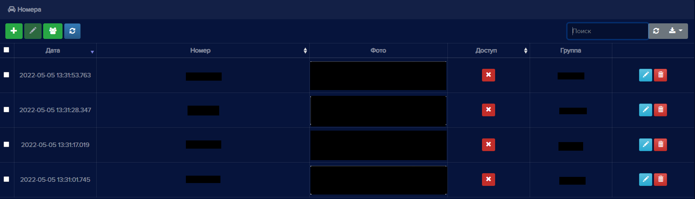
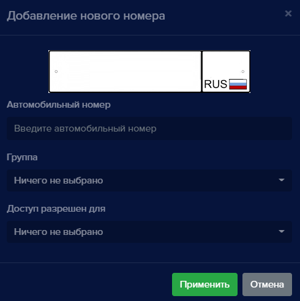
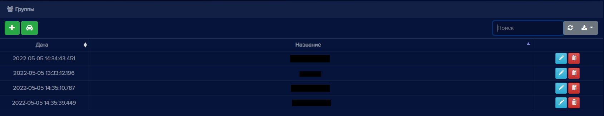

### Номера

На вкладке **Номера** создается база данных автомобильных номеров для распознавания. Для каждого номера настраивается доступ на устройства, добавленные в **eVision**, тем самым разрешается  или запрещается автомобилю проезд на территорию. Также есть возможность объединения номера в группы для задания обюх правил определенным номерам.

Поддерживаются только российские автомобильные однорядные номера:

Номер допускается указывать тремя буквами А,В,Е,К,М,Н,О,Р,С,Т,У,Х и тремя цифрами. Регион допускается указывать двумя или тремя цифрами.

Для автомобильных номеров доступны следующие операции:
- Добавление номера
- Редактирование номера и доступа через устройства
- Удаление номера
- Поиск.
- Обновление списка номеров
- Экспорт таблицы номеров в файлы разных форматов
- Группировка номеров

В поле Доступ в списке номеров значок  означает, что у автомобильного номера есть доступ на территорию через устройства, значок   - доступа нет.

Данные в таблице номеров можно сортировать по дате, номеру и доступу.

#### Добавление номера

- Чтобы добавить номер, нажмите кнопку **Добавить новый номер** . Откроется окно **Добавление нового номера**:

- Введите серию, номер и код региона автомобильного номера в соответствующее поле. При этом верхний графический элемент заполняется автоматически.

**!** Обратите внимание, что в поле **Автомобильный номер** серию номера можно вводить русскими и английскими буквами. Однако при вводе русских букв они автоматически будут преобразованы в заглавные английские. Внешне буквы будут выглядеть одинаково, но записан номер будет в англоязычном формате. Данная транслитерация необходима для хранения номеров в едином формате. Поле **Автомобильные номера** не принимает русские буквы Б,Г,Д,Ё,Ж,З,И,Л,П,Ф,Ц,Ч,Ш,Щ,Й,Ь,Ъ,Э,Ю,Я.

Транслитерация русских букв в английские:

|Русская буква||Английская буква||
|-|-|-|-|
|Печатная буква|Произношение|Печатная буква|Произношение|
|А,а|[а]|A,a|[эй]|
|В,в |[вэ]|B,b|[би]|
|С,с|[эс]|C,c|[си]|
|Е,е|[е]|E,e|[и]|
|Н,н|[эн]|H,h|[эйч]|
|К,к|[ка]|K,k|[кей]|
|М,м|[эм]|M,m|[эм]|
|О,о|[о]|O,o|[оу]|
|Р,р|[эр]|P,p|[пи]|
|Т,т|[т]|T,t|[ти]|
|Х,х|[ха]|X,x|[экс]|
|У,у|[у]|Y,y|[уай]|

- В поле **Группа** можете выбрать группу, чтобы дать автомобильному номеру определенные свойства выбранной группы. Если вы ничего не выберете, то автомобильный номер не будет принадлежать ни к одной группе.

- Выберите устройство или несколько устройств, через которые транспортному средству разрешен въезд. Если устройство не выбрано, то доступ будет закрыт. Поле **Доступ разрешен для** можно заполнить позднее при операции редактирования.

#### Редактирование номера

Чтобы изменить данные автомобильного номера или доступ через устройства, нажмите кнопку **Редактировать** . Откроется окно **Редактировать номер**:

Вы можете изменить автомобильный номер, группу и доступ. 

#### Удаление номера

Чтобы удалить номер, нажмите кнопку **Удалить номер** . Откроется окно подтверждения удаления:

### Группы номеров

Данный раздел предназначен для создания и редактирования групп, в которые можно объединять автомобильные номера. 

Находясь в разделе **Номера**, вы можете взаимодействовать с группами: создавать, редактировать, удалять.

Нажмите на кнопку "Переключиться на группы" , чтобы увидеть список групп:

Данные в таблице можно сортировать по дате и по названию группы.

Для **Групп** доступны следующие операции:
- Добавление группы
- Редактирование названия группы
- Удаление группы. При удалении группы автомобильные номера не удаляются, а исключаются из группы
- Поиск
- Обновление списка групп
- Экспорт таблицы групп в файлы разных форматов

#### Добавление группы

Чтобы добавить группу, нажмите на кнопку **Добавить новую группу** .

Откроется окно добавления новой группы:

Введите название группы, выберите автомобильные номера, которые будут в этой группе. Вы также можете включить ограничения и выбрать максимально разрешенное количество доступов для номеров из группы (например, в группе четыре автомобильных номера, но одновременно доступ может быть разрешен только трем из них). Нажмите кнопку **Применить**. Группа появится в списке групп.

#### Редактирование группы

Нажмите на кнопку редактирования  напротив нужной группы.

Откроется окно редактирования группы:

 

Вы можете изменить название группы, выбрать автомобильные номера, для которых добавите ограничения: 

  **Одновременно максимально разрешено** - максимально разрешенное количество номеров на парковке;
  **Текущие** - номера, которые нв данный момент находятся на парковке. 

#### Удаление группы

Нажмите кнопку удаления  напротив нужной группы. Появится окно подтверждения удаления. Нажмите **Удалить** и группа будет удалена.

#### Переключиться в режим Номера

Для переключения на номера из групп нажмите кнопку **Переключиться на автомобильные номера** .
