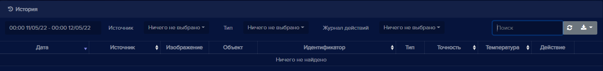
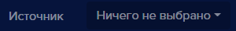
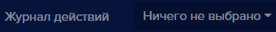

### История
Вкладка **История** служит для хранения истории распознанных силуэтов, лиц, автотранспорта и автомобильных номеров, также здесь отображаются события: **открытие замка**, **доступ запрещен**, **голосовое уведомление**.

#### Элементы вкладки "История"

|Элемент интерфейса|Описание|
| :- | :- |
||Область для выбора периода просмотра истории. При нажати на календарь появляется возможность выбора периода и времени отображения событий.|
||Поле **Источник** позволяет выбирать события в истории по выбранному устройству.|
||Поле **Тип** позволяет выбирать тип объектов для просмотра в истории: **Лицо** - в истории отображается распознавание лиц, **Пользователи** - распознавание людей, **Автомобиль** и **Автомобильные номера** - распознавание автомобилей и номеров автомобилей. Если не выбран какой-либо тип, то в истории отображаются все распознанные объекты.|
||Поле **Журнал действий** позволяет выбрать определенные действия, которые были связаны с замком и уведомлениями. Доступны варианты: **Открытие замка**, **Доступ запрещен**.|
||Область для поиска по истории распознаваний. Также здесь расположены кнопки для обновления истории и экпорта данных.|

Пример данных:

|Элемент интерфейса|Описание|
| :- | :- |
||Распознано лицо человека (включена **Видеоаналитика** и активирован режим **Распознавания лиц**).|
||Распознано лицо человека, которого нет в базе пользователей.|
||Распознано лицо человека, который есть в базе пользователей.|
||Распознан силуэт человека.|
||Распознан силуэт автомобиля.|
||Распознан автомобильный номер, которого нет в базе автомобильных номеров.|
||Распознан Автомобильный номер, который есть в базе номеров.|
||Доступ запрещен. Данному пользователю или автомобильному номеру запрещен доступ на устройстве.|
||Точность с которой распознанное лицо совпадает с лицом пользователя.|
||Распознано лицо человека, который есть в базе пользователей, данному сотруднику доступ на устройстве разрешен.|

Данные в **Истории** можно сортировать по дате, источнику, идентификатору, точности и по температуре. 

Если алгоритм распознавания не может установить сходство с имеющимися объектами в базе, то в поле **Идентификатор**  появится знак * (“звездочка”). За сравнение отвечает параметр **Порог распознавания**.