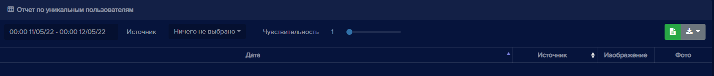
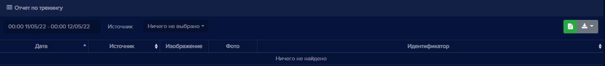

### Отчеты

На вкладке **Отчеты** находятся пункты: **Пользователи, Группы, Устройства, Системный журнал, Рабочее время, Уникальные, Трекинг, Учет рабочего времени**. В каждом отчете есть календарь, в котором можно выбрать диапазон дат и время для отображения информации.

Область для выбора дат и времени. При нажатии на календарь появляется возможность выбора даты и времени отображения событий:

В каждом отчете доступны операции: поиск, обновление данных, экспорт событий истории в файлы различных форматов. 

#### Отчет по пользователям

В данном отчете отображается информация по посещениям пользователей.

Опция **Только отсутствующие** включает отображение в отчете пользователей, которые не распознаны в выбранном временном промежутке.

Поля **Устройства входа**  и **Устройства выхода** предоставляют выбор устройств для формирования отчета распознавания пользователей.

#### Отчет по группам

В данном отчете отображается информация по распознаванию пользователей по группам, в которые они включены. Отображается количество распознанных пользователей в каждой группе.

#### Отчет по устройствам

В данном отчете отображается количество распознанных персон по каждому устройству.

#### Системный журнал

В данном отчете отображаются действия, происзощедшие внутри программы. Список событий можно увидеть в фильтрах отчета.

#### Отчет по рабочему времени

В данном отчете отображается время, в течение которого персоны были распознаны в зоне обзора камеры.

#### Отчет по уникальным пользователям

В данном отчете отображается количество уникальных распознанных пользователей.

Поле **Источник** позволяет отобразить в отчете уникальных пользователей с выбранного устройства.

Пункт **Чувствительность** позволяет увеличить или уменьшить точность, с которой отображаются распознанные пользователи.

#### Отчет по трекингу

В данном отчете отображается информация о распознавании пользователей по трекингу. По трекингу отслеживается перемещение человека по территории объекта, создаются фрагменты фотографий, на которых он появлялся, расположив их в хронологическом порядке.  

#### Отчет по учету рабочего времени

В данном отчете формируются сводные данные о суммарном времени работы по пользователю за определенный период.

