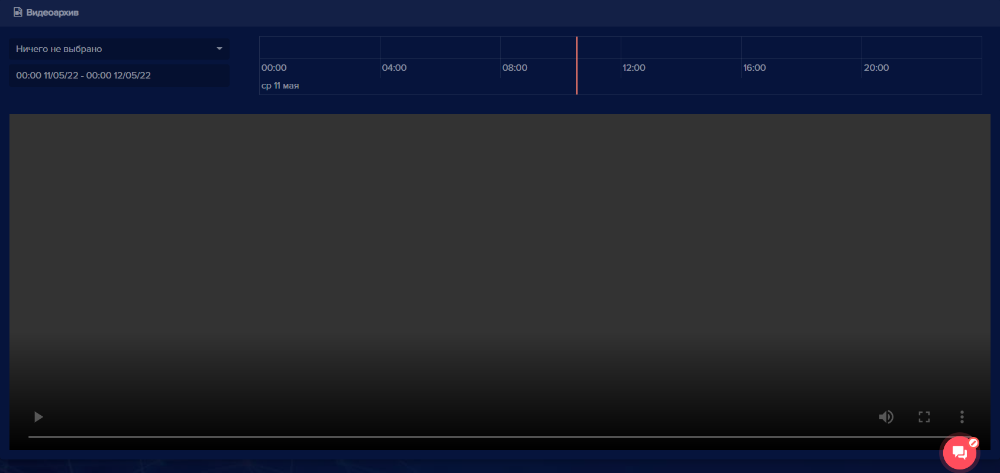
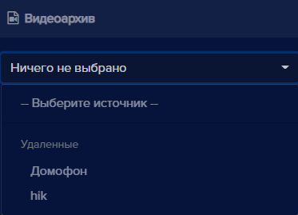
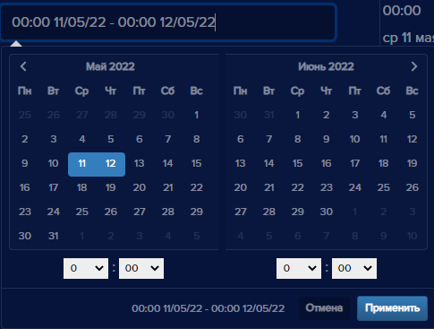
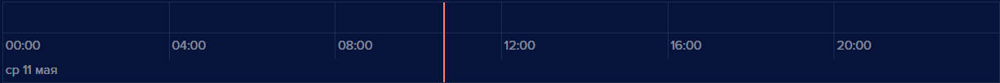
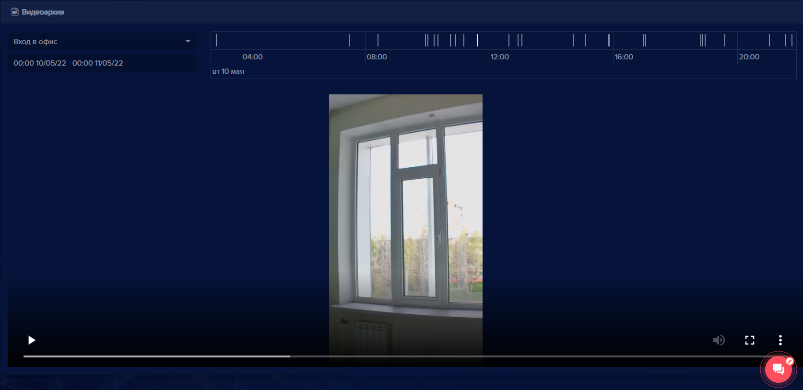
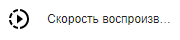

Вкладка **Видеоархив** предназначена для просмотра файлов из видеоархива. 

Для  просмотра файлов выберите устройство из списка:

Выберите из выпадающего календаря или введите вручную период времени, за который нужно отобразить видеоархив:

**Внимание**: период хранения видео зависит от настроек (по умолчанию 3 суток).

В шкале времени выберите видеоролик, который необходимо воспроизвести (продолжительность одного ролика 10 минут).

Отобразится запись видеоархива за выбранное время. Активная часть шкалы подсветится желтым.

Для видео доступны операции управления:

|Элемент|Описание|
| :- | :- |
||Воспроизведение видео.|
||Остановка воспроизведения.|
||Настройка звука. Имеет смысл только в случае, если видеоустройство оборудовано микрофоном и записывало звук.|
||Полноэкранное видео или обычное.|
||Меню расширенных настроек содержит пункты **Скачать** и **Скорость воспроизведения**.|
||Скачивание выбранного видео.|
||Изменение скорости воспроизведения видео.|
||Открытие выбранного видео в отдельном окне.|
||Выпадающее меню, в котором доступно сохранение видео в избранное.|