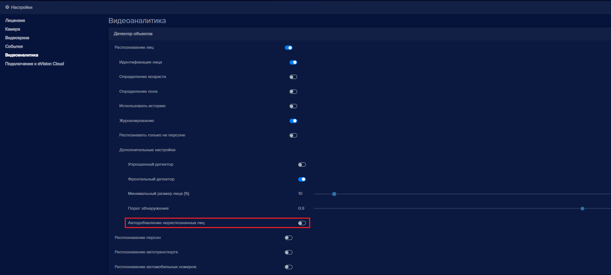
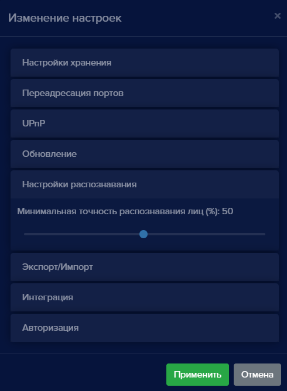

В **eVision** существует возможность собрать базу пользователей автоматически. Это можно применять в начале использования **eVision**, если еще нет качественных фотографий пользователей. 

Автодобавление пользователей позволяет добавлять их при распознавании лиц. После того, как все необходимые пользователи добавлены, автодобавление необходимо отключить. Добавленных пользователей необходимо отредактировать, ввести имена и фамилии, при необходимости выбрать группу, указать идентификатор и включить или выключить доступ на устройство. 

#### Включение автодобавления пользователей

Чтобы включить автодобавление пользователей:

- Перейдите в режим редактирования устройства .
- Перейдите в раздел **Видеоаналитика** и включите **Распознавание лиц**:

- Найдите пункт **Автодобавление нераспознанных лиц** и активируйте переключатель:

- Нажмите кнопку **Сохранить**.

Окно подтверждения настроек закроется.

После распознавания лиц в базе пользователей появятся новые записи, на которых будут зафиксированы лица людей. Такие записи необходимо отредактировать пользователя (как отредактировать, см. пункт [Редактирование пользователя](#_conv1l9o3mwg)).

**!** Обратите внимание, что в зависимости от настроек распознавания (см. пункт. [Настройки распознавания](#_ulhscr8sbkd0)) будет добавлено разное количество пользователей. Чем выше порог распознавания, тем больше пользователей будет автоматически добавлено. Дело в том, что большое значение имеет направление взгляда человека и его эмоции в момент распознавания. Может получится так, что один и тот же человек будет добавлен несколько раз. Повторяющихся пользователей с некачественными фотографиями нужно удалить и оставить только одного пользователя с правильным именем и настройками доступа.

Рекомендуем настройки точности распознавания оставить на уровне 30-40 %, в таком случае повторных автодобавленных персон будет меньше. Минимальная точность настраивается в общих настройках программы в правом верхнем углу.

 

После сбора базы персон, добавленных в **eVision**, необходимо выключить Автодобавление. 

#### Выключение автодобавления пользователей

Чтобы выключить автодобавление, переведите переключатель **Автодобавление нераспознанных пользователей** в неактивное состояние и сохраните настройки устройства.

Настройки распознавания приведите к значению по умолчанию - 50%.

Автодобавление будет выключено и новые персоны добавляться не будут.
