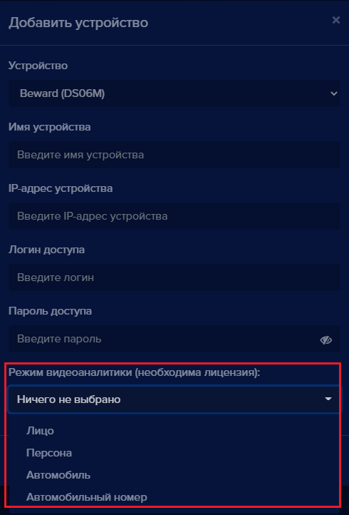
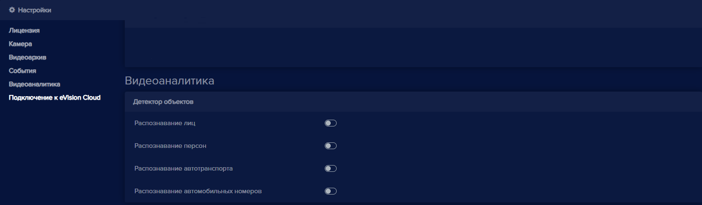
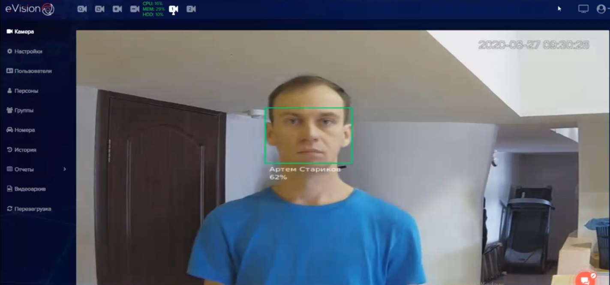
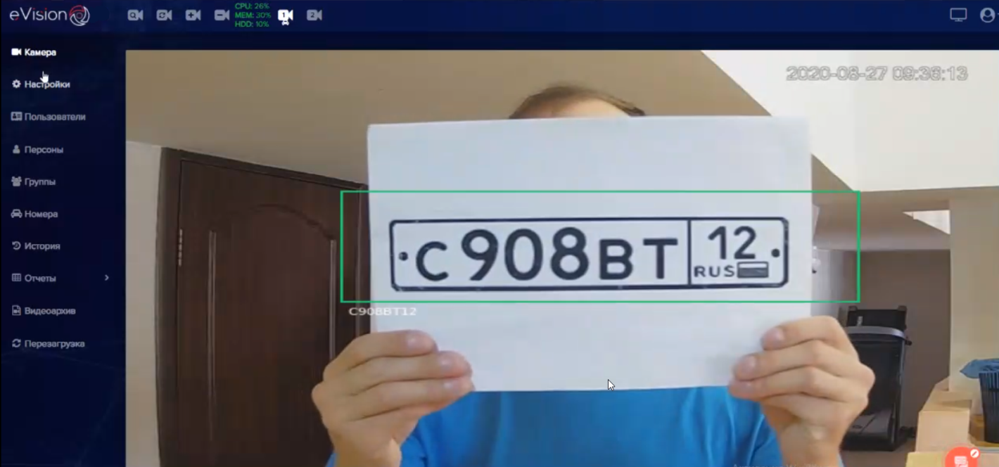

Режим видеоаналитики выбирается при добавлении устройства и в настройках устройства.

- При добавлении устройства:

- В настройках этого устройства:

#### Как проверить видеоаналитику?

Когда добавлено устройство, введен лицензионный ключ и включена видеоаналитика, можно проверить распознавание объектов. По умолчанию при добавлении устройства выбирается режим **Лицо**.

#### Распознавание лиц

Когда человек появляется в зоне распознавания, на видеопотоке при распознавании появляется цветная рамка с именем или идентификатором пользователя:

#### Распознавание автомобильных номеров

Когда автомобильный номер машины появляется в зоне распознавания, на видеопотоке при распознавании появляется цветная рамка с идентификатором номера:

