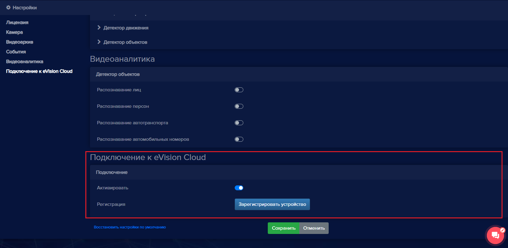

Чтобы включить сервис **eVision Cloud**: 

- В настройках устройства перейдите к разделу **Подключение к eVision Cloud**:

- Включите **Активировать**.
- Нажмите кнопку **Зарегистрировать устройство**.

Откроется окно авторизации в сервисе eVision.Cloud. 

- Вернитесь в окно eVision.
- Сохраните настройки устройства, нажав кнопку **Сохранить**.

После этого устройство будет доступно в сервисе eVision.Cloud.