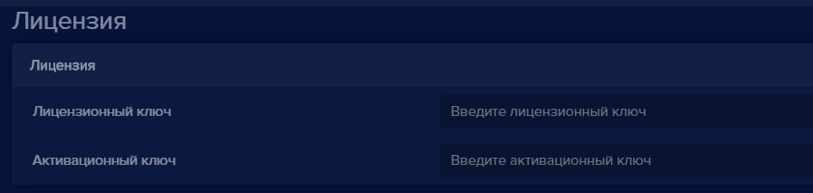
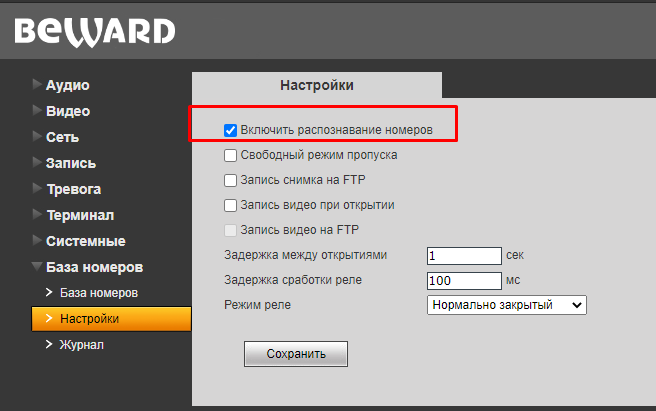

#### Как добавить камеру Beward B2230-LP 

Чтобы добавить камеру со встроенным распознаванием автомобильных номеров, нажмите кнопку **Добавить устройство** на вкладке **Устройства**. Откроется окно **Добавить устройство** с выпадающим списком **Устройство**:

  

- Выберите пункт **Beward (B2230-LP)**.
- В поле **Имя устройства** введите наименование устройства.
- В поле **IP-адрес устройства** введите корректный IP адрес видеоустройства.
- В поле **Логин доступа** введите логин для доступа на устройство.
- В поле **Пароль доступа** введите пароль для доступа на устройство.
- В поле **Режим видеоаналитики (необходима лицензия)** выберите **Автомобильный номер**.
- Нажмите кнопку **Добавить**. Откроется окно, в котором транслируется видео с данного устройства.
- Перейдите в настройки устройства Beward B2230-LP в **eVision**  .
- Найдите блок **Лицензия**, введите новый лицензионный ключ и активируйте его либо введите уже имеющиеся лицензионный и активационный ключи.
  
    

**Важно:** Для синхронизации камеры Beward B2230-LP необходима лицензия Plus или Pro. Приобрести лицензионный ключ можно в нашем интернет магазине: https://cryptostore.ru/catalog/faceid/

- Если лицензия уже введена и активирована, перейдите в настройки устройства Beward B2230-LP в **eVision**. 
- Найдите блок **Лицензия**, переключатель **Активация** переведите в активное состояние:
- Сохраните настройки устройства.
- Перейдите в настройки устройства Beward B2230-LP в **eVision**, найдите блок **Видеоаналитика**, переключатель **Распознавание автомобильных номеров** переведите в активное состояние:

  

- Сохраните настройки устройства.
- Перейдите на вкладку **Номера**, добавьте автомобильные номера транспортных средств, которым необходимо обеспечить пропуск на территорию.

  

**Важно:** При добавлении номера обязательно указывайте камеру Beward B2230-LP в поле "Доступ разрешен для". В таком случае номер автомобиля будет автоматически добавлен в список номеров с разрешенным доступом на самой камере.

  

Проверить список номеров, которым разрешен доступ, можно в интерфейсе камеры на вкладке **База номеров**:

  

Камера готова к работе. 

**Важно:** Далее будет необходимо подключить управляющее реле камеры к исполнительному устройству турникета, шлагбаума или другому запирающему устройству. Распознанные номера с камеры каждые две минуты автоматически загружаются в историю **eVision**. Данные события можно просмотреть на вкладке **История**.

#### Как синхронизировать, если видеоаналитику не включили сразу:

Если сначала были созданы номера в **eVision**, а камера добавлена позже, то необходимо синхронизировать камеру **Beward B2230-LP** и **eVision**:

- Перейдите на вкладку **Номера** и проверьте, что номера добавлены в **eVision** 

- Если лицензия уже введена в настройках устройства и активна, перейдите в настройки камеры Beward B2230-LP в **eVision**, найдите блок **Видеоаналитика**, переключатель **Распознавание автомобильных номеров** переведите в активное состояние:

  

- Сохраните настройки устройства.
- Если лицензия не введена, то воспользуйтесь пунктом **Как активировать лицензию** в данном руководстве.
- После активации лицензии перейдите в раздел **Номера**, нажмите кнопку **Синхронизировать с Beward B2230-LP**. 

  

После успешной синхронизации база номеров в eVision и на камере синхронизируются.

При этом на самой камере Beward B2230-LP активируется встроенное распознавание номеров и добавятся номера, созданные в eVision.  

    

   

Чтобы отключить синхронизацию eVision c камерой Beward B2230-LP:

- Переведите переключатель **Распознавание автомобильных номеров** в неактивное состояние:

- Сохраните настройки устройства.
- Перейдите в интерфейс камеры на вкладку **База номеров** в раздел **Настройки**, снимите галочку **Включить распознавание номеров**.
- Нажмите кнопку **Сохранить**.

Синхронизация камеры Beward B2230-LP и eVision будет отключена.