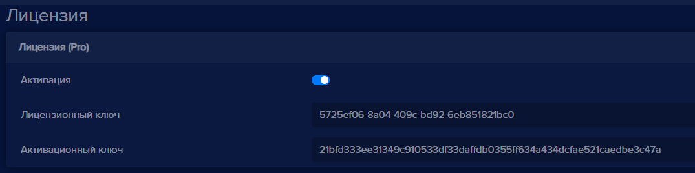

Отчет рабочее время работает на основании данных, полученных при распознавании персон (силуэтов людей) в зоне действия камеры. Рабочее время начинает отсчет от первого распознавания персоны. Оно означает начало рабочего дня. Последнее распознавание персоны -  окончание рабочего дня. Чтобы начать учитывать рабочее время:

- Добавьте камеру в eVision

**Важно:** Камера должна быть установлена так, чтобы в ее обзор попала территория, в которой происходит движение людей. Камера может быть расположена на стене, наверху или на потолке.  

- В настройках камеры в **eVision** в блоке **Активация** активируйте лицензионный ключ, переключатель **Активация** должен быть включен.

**Важно:** Для работы видеоаналитики необходима лицензия Pro.

- В настройках камеры в **eVision** в блоке **Видеоаналитика** выберите детектор объектов **Распознавание персон**:

- Сохраните настройки устройства.

Октроется окно трансляции камеры, в левом верхнем углу появятся распозанные персоны с идентификаторами:

- Перейдите в раздел **Отчеты**, выберите отчет **Рабочее время**. Откроется форма отчета:

  
- Выберите в календаре интересующий вас день: первым укажите день, в который необходимо увидеть данные, а вторым укажите день, следующий за интересующим, как показано на скриншоте:
  

- Нажмите кнопку **Применить**.

- В поле устройство выберите камеру, на которой включено распознавание персон: 

**Важно:** В поле рабочее время показано время работы, указанное в настройках устройства, менять его не нужно.

- Нажмите кнопку **Сформировать отчет**. Появятся данные о времени открытия, времени закрытия и общем времени работы точки:

