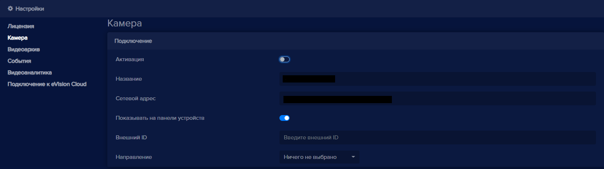

Чтобы временно отключить (деактивировать) устройство в **eVision**:

- Добавьте устройство в **eVision**.
- Перейдите на вкладку **Устройства** и нажмите на кнопку редактирования напротив нужного устройства .
- В настройках перейдите в раздел **Камера** и поставьте переключатель **Активация** в неактивное состояние:

- Нажмите кнопку **Сохранить**. Появится уведомление с подтверждением сохранения настроек.
- Нажмите кнопку **Да**. В окне трансляции видеопотока устройства появится сообщение: 

**!** Видеоаналитика будет недоступна на этом устройстве.

