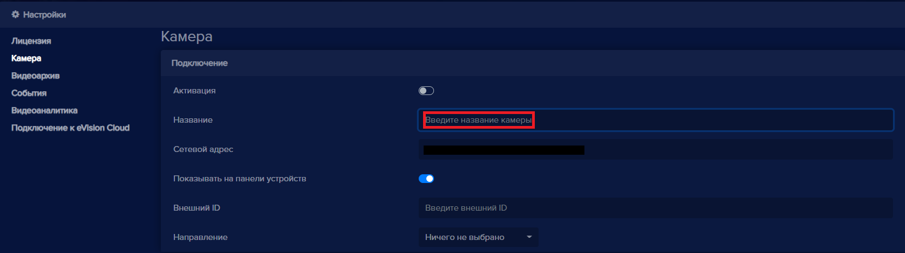

Каждому устройству название задается при его добавлении. 

Для изменения названия устройства:

- Нажмите на кнопку **Редактировать** напротив нужного устройства .
- В настройках перейдите в раздел **Камера**.
- В поле **Название** измените название устройства:

- Нажмите кнопку **Сохранить**.
- Вернитесь на вкладку **Устройства**.
- Название устройства будет изменено.
