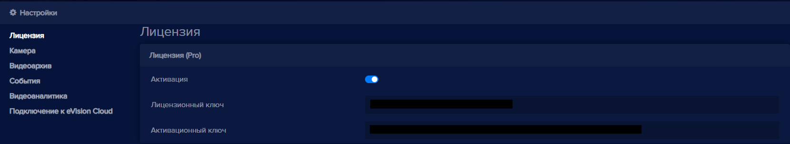

Чтобы активировать лицензию:

- Добавьте устройство в **eVision**.
- Перейдите на вкладку **Устройства** и нажмите кнопку **Редактировать** напротив нужного устройства:

- В окне настроек перейдите на вкладку **Лицензия**.
- Введите лицензионный ключ в поле **Лицензионный ключ**, появится кнопка **Активировать лицензию**:

  

- Нажмите кнопку **Активировать лицензию**. В настройках появится надпись с типом лицензии в заголовке блока Лицензия, переключатель **Активация**, а также в поле **Активционный ключ** появится сгенерированный на сервере активационный ключ для данного лицензионного ключа. Лицензия успешно активирована.

  

- Нажмите на переключатель **Активация** и нажмите кнопку **Сохранить**.

После завершения сохранения настроек перключатель Активация будет в активном состоянии, затем можно выбирать тип объектов для распознавания.

- В настройках устройства найдите пункт **Видеоаналитика**:

  

- Нажмите на один или несколько переключателей **Распознавание лиц, Распознавание персон, Распознавание автотранспорта**, **Распознавание автомобильных номеров**. Появятся настройки выбранного детектора объектов.

- Нажмите кнопку **Сохранить**.

- Проверьте распознавание объектов.

**Важно:** Сохраните лицензионный и активационный ключи. В случае их удаления или удаления устройства восстановить пару ключей невозможно. Активационный и лицензионный ключи можно использовать на данном компьютере для одного устройства.

