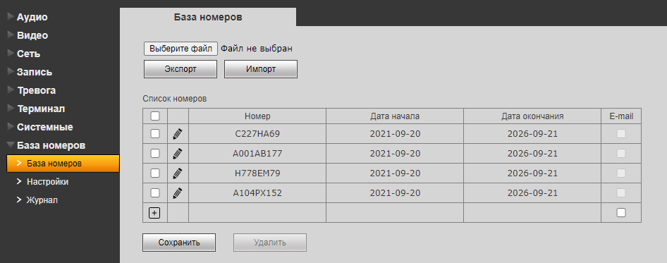

Для того, чтобы добавить камеру Beward B2230L-P, нажмите кнопку **Добавить устройство**  на **Панели устройств**. Откроется окно **Добавить устройство**, с выпадающим списком **Устройство**

- Выберите устройство Beward (B2230L-P)

Откроется форма для ввода параметров устройства

- В поле **Имя устройства** введите наименование нового устройства, для ввода допускаются буквы и цифры. Укажите уникальное имя, означающее назначение или местоположение устройства, например *Въезд, Парковка, Шлагбаум*
- В поле **IP-адрес устройства** введите корректный IP адрес видеоустройства,
- В поле **Логин доступа** введите логин для доступа на устройство,
- В поле **Пароль доступа** введите пароль для доступа на устройство,
- В поле **Режим видеоаналитики (необходима лицензия)** выберите **Автомобильные номера**,
- Нажмите кнопку **Добавить**, откроется окно, в котором транслируется видео с данного устройства.

  

**Важно:** При добавлении камеры Beward B2230L-P необходима лицензия Plus или Pro. Лицензию необходимо активировать и включить детектор объектов в режиме **Автомобильные номера**.

- Перейдите на вкладку **Номера**, добавьте автомобильные номера транспортных средств, которым необходимо обеспечить пропуск на территорию.

  

**Важно:** При добавлении номера обязательно указывайте камеру Beward B2230L-P в поле "Доступ разрешен для". В таком случае номер автомобиля будет автоматически добавлен в список номеров с разрешенным доступом на самой камере.

  

Проверить список номеров, которым разрешен доступ можно в интерфейсе камеры, на вкладке **База номеров**

  