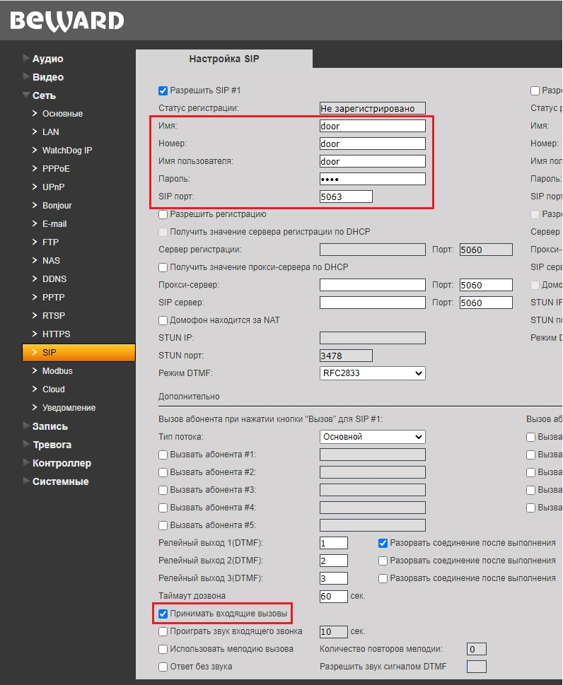
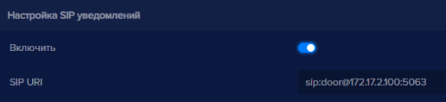

Для использовани уведомления по SIP протоколу необходимо, чтобы устройство для распознавания поддерживало входящие вызовы по SIP без регистрации. Для примера будет использовано устройство Beward DS06A. Необходимо произвести предварительную настройку устройства Beward DS06A, для этого:

- Откройте в браузере интерфейс Beward DS06A. По умолчанию IP адрес Beward DS06A: *192.168.0.99*
- Перейдите в раздел **Сеть**, найдите пункт **SIP**
- Отметьте галочкой пункт **Разрешить SIP # 1**
- Пропишите в поля: **Имя, Номер, Имя пользователя** краткий идентификатор для sip вызова на устройство Beward DS06A.
- В поле **Пароль** введите пароль, он может не использоваться для работы sip уведомлений, но он необходимо для безопасности.
- В поле **SIP порт** можно прописать порт для приема SIP вызова из eVision, но этот параметр необязателен.
- Отметьте галочкой пункт **Принимать входящие вызовы**
- Нажмите кнопку **Сохранить**

Для включения SIP уведомлений в программе, вам необходимо:

Выберите устройство, нажмите на его номер на панели устройств 

Откроется видеопоток выбранного устройства

Откройте **Настройки** 
Найдите блок **Голосовой сервис**, найдите пункт **Настройка SIP уведомлений**
Переведите переключатель **Включить** в состояние включено 
Пропишите в строке **SIP URI** строку для обращения **eVision** к устройству Beward DS06A в формате: *sip:door@172.17.2.100:5063*. Где: door - номер устройства, который был введен в настройках устройства Beward DS06A, в пункте **SIP**; 172.17.2.100 - IP адрес устройства Beward DS06A; 5063 - порт для SIP вызова, необязательный параметр.

- Нажмите кнопку **Сохранить** , появится уведомление:

- Нажмите кнопку **Да**.

Окно подтверждения настроек закроется. Теперь SIP уведомления можно проверить. 

Следует помнить, что при использовании sip уведомлений, необходимо, чтобы был настроек замок. Настройка замка описана в пункте [25](#_xl0s61bc2vfd), данного руководства.

