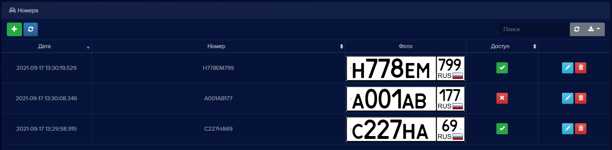
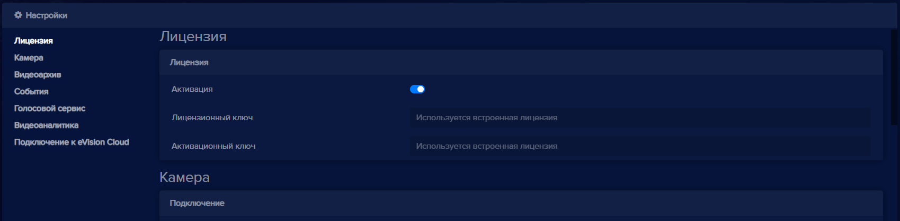
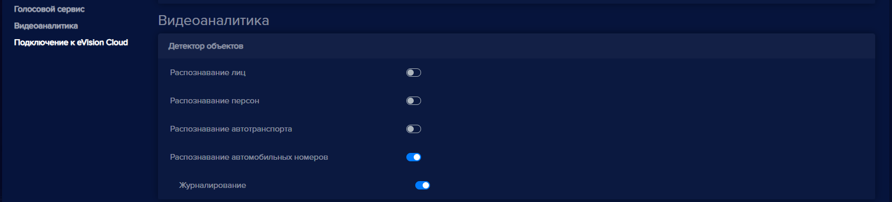
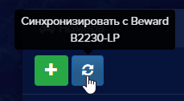
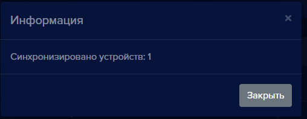
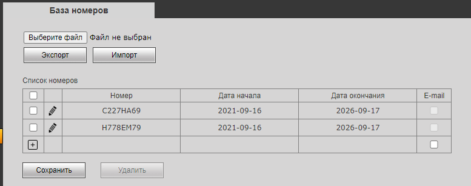
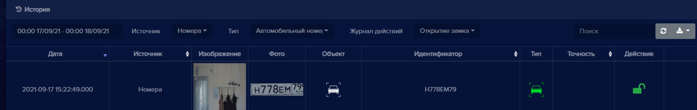

Для того, чтобы добавить камеру со встроенным распознаванием автомобильных номеров, нажмите кнопку **Добавить устройство**  на **Панели устройств**. Откроется окно **Добавить устройство**, с выпадающим списком **Устройство**

  

- Выберите пункт **Beward (B2230L-P)**,
- В поле **Имя устройства** введите наименование устройства,
- В поле **IP-адрес устройства** введите корректный IP адрес видеоустройства,
- В поле **Логин доступа** введите логин для доступа на устройство,
- В поле **Пароль доступа** введите пароль для доступа на устройство,
- В поле **Режим видеоаналитики (необходима лицензия)** выберите **Автомобильный номер**,
- Нажмите кнопку **Добавить**, откроется окно, в котором транслируется видео с данного устройства, а также на вкладке **Номера** появится кнопка для синхронизации базы номеров из **eVision** с базой номеров на камере Beward B2230L-P.

- Наполните базу номеров в **eVision** и разрешить доступ необходимым номерам. 

  

- Активируйте видеоаналитику на камере Beward B2230L-P, либо добавить камеру первой по счету, чтобы применилась встроенная лицензия

  

- Выберите режим видеоаналитики **Распознавание автомобильных номеров**

  

- Сохраните настройки устройства

- Перейдите в раздел **Номера**, нажмите кнопку **Синхронизировать с Beward B2230L-P** 

  

После успешной синхронизации база номеров в eVision и на камере синхронизируются

  

При этом на самой камере Beward B2230L-P активируется встроенное распознавание номеров и добавляются номера, созданные в eVision.  

    

   

Камера готова к работе. 

Далее будет необходимо подключить управляющее реле камеры к исполнительному устройству турникета, шлагбаума или другому запирающему устройству. Распознанные номера с камеры каждые две минуты автоматически загружаются в историю **eVision**. Данные события можно просмотреть на вкладке **История**.

Для того, чтобы отключить синхронизацию eVision c камерой Beward B2230L-P:

- Перейдите в настройки устройства Beward B2230L-P
- Нажмите на переключатель **Распознавание автомобильных номеров**, переведите его в неактивное состояние

- Сохраните настройки
