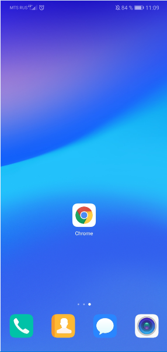
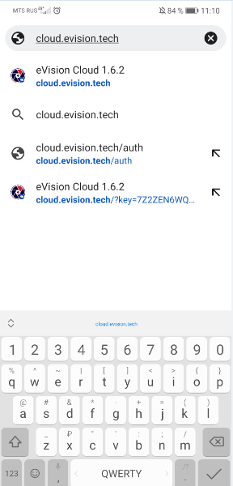
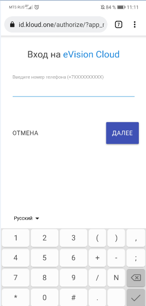
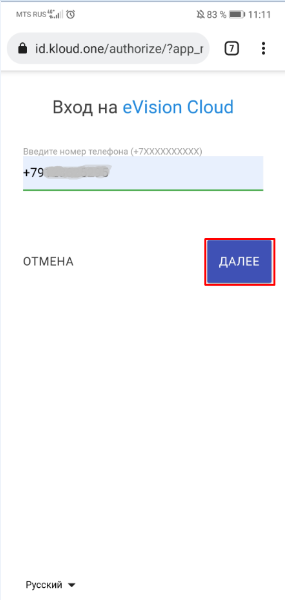
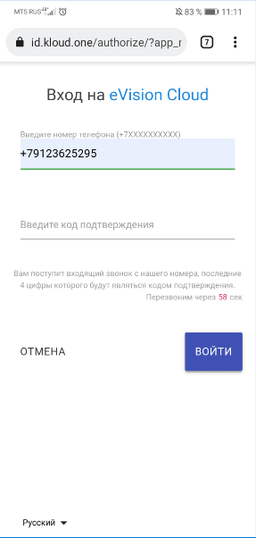
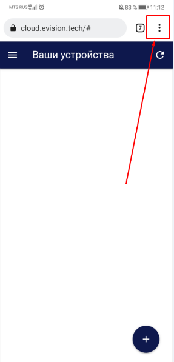
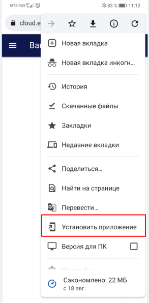
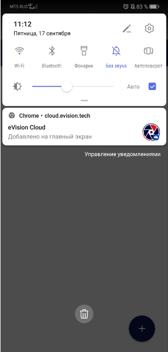
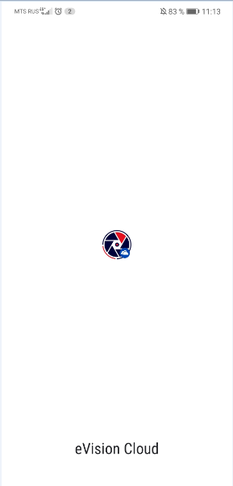

#### Установка приложения eVision Cloud на мобильное утройство

Для того чтобы устрановить eVision Cloud и добавить на главный экран вашего мобильного утройства, необходимо выполнить следующие шаги:

1. Запустить браузер на вашем мобильном устройстве.

2. Открыть новую вкладку браузера.

.png)

3. Ввести в поисковую строку **cloud.evision.tech** или перейти по ссылке https://cloud.evision.tech/

4. Откроется страница с авторизацией в сервисе eVision Cloud через KloudID.

5. В поле ввода номера телефона введите свой номер телефона начиная с +7 и нажмите кнопку "Далее".

6. После нажатия на кнопку "Далее" появится поле для ввода кода подтверждения. В течении 5-10 секунд на ваш номер телефона будет произведен звонок.  
Последние четыре цифры номера звонящего являются кодом доступа для вашей авторизации на сервисе eVision Cloud. Например в нашем случае 8103.

.png)

7. Водим последние четыре цифры в поле для **Ввода кода подтверждения** и нажимаем кнопку **Далее**.

.png)

8. В браузере открывается eVision Cloud в котором вы авторизовались.  
Для установки приложение eVision Cloud на ваше мобильное устройство откройте **Контекстное меню** браузера. 

9. В открывшемся **Контестном меню** найдите функцию **Установить приложение** и нажмите на неё.

10.  Для установки нажмите на кнопку **Установить** и дождитесь окончания установики приложения.

.png)

11.  После установки приложение **eVision Cloud** будет добавлено на ваш главный экран.

.png)

12.  Для его открытия нажимаем на уже установленное на главном экране приложение **eVision Cloud**

.png)

Теперь на вашем мобильном устройстве установлен eVisiom Cloud. 