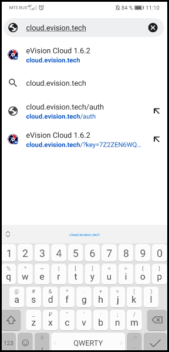
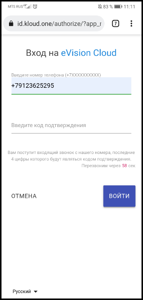

#### Установка приложения eVision Cloud на мобильное устройство

Для того чтобы устрановить eVision Cloud и добавить на главный экран вашего мобильного утройства, необходимо выполнить следующие шаги:

1. Запускаем браузер на вашем мобильном устройстве.

2. Открываем новую вкладку браузера.

.png)

3. Вводим в поисковую строку **cloud.evision.tech** или переходим по ссылке https://cloud.evision.tech/

4. Откроется страница с авторизацией в сервисе eVision Cloud через KloudID.

5. В поле ввода номера телефона вводим свой номер телефона, начиная с +7, и нажимаем кнопку "Далее".

6. После нажатия на кнопку "Далее" появится поле для ввода кода подтверждения. В течении 5-10 секунд на ваш номер телефона будет произведен звонок.  
Последние четыре цифры номера звонящего являются кодом доступа для вашей авторизации на сервисе eVision Cloud. Например в нашем случае 8103.

.png)

7. Вводим последние четыре цифры в поле для **Ввода кода подтверждения** и нажимаем кнопку **Далее**.

.png)

8. В браузере откроется ваш личный кабинет. Чтобы сохранить вкладку сервиса в качестве приложения на вашем мобильном устройстве открываем **Контекстное меню** браузера. 

9. В открывшемся **Контестном меню** находим функцию **Установить приложение** и нажимаем на неё.

10.  Для установки нажимаем на кнопку **Установить** и дожидаемся окончания установики.

.png)

11.  После установки **eVision Cloud** будет добавлен на ваш главный экран.

.png)

12.  Для его открытия нажимаем на уже установленное на главном экране приложение **eVision Cloud**

.png)

Теперь на вашем мобильном устройстве установлен eVision Cloud. 