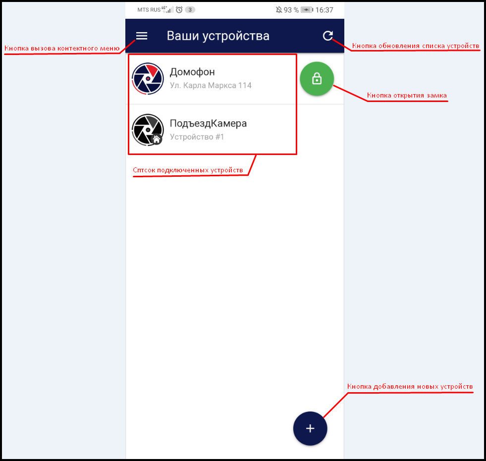

 

В верхней части экрана расположена:

  Кнопка вызова контекстного меню, при нажатии на которую открывается  поле с информацией о текущей **версии сервиса eVision Cloud**, кнопка перехода к **списку подключенных устройств**, **идентификатор пользователя** (в данном случае это номер телефона) и **кнопка выхода**.

В основном Окне отображается список подключенных устройств.

.png)  Иконка, которая отображает устройства, подключенные непосредственно к eVision Cloud.

.png) Иконка для устройств, подключенные через сервер видеонаблюдения eVision.

.png) Кнопка удаленного открытия замка, позволяющая открывать домофон из веб-интерфейса приложения.

.png) В нижней части экрана находится кнопка для добавления новых устройств.

.png) 