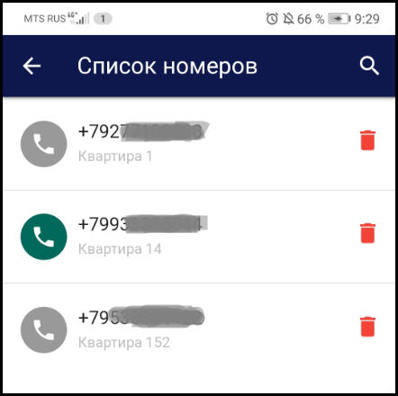

В добавленном устройстве доступен следующий функционал: 

  **Камера.** При переходе на данную вкладку открывается просмотр видео с камеры устройства. На экране просмотра также доступна кнопка электронного ключа, позволяющая открывать замок из приложения.

.png)  **История.** При переходже на данную вкладку открывается история действий связанных с этим устройством.

.png)  **Отчеты.** При переходе на данную вкладку открывается отчет по персонам.

.png)  **Информация об устройстве.** При нажатии раскрывается список из следующих полей: Идентификатор, наименование, тип и описание устройства, параметры сетевого подключения и лицензионный ключ.

.png)  **Права доступа.** Добавление новых и редактирование списка существующих номеров телефонов, кому предоставлен доступ на просмотр и редактирование устройства. 

.png)  **Яндекс.Алиса.** Привязка устройства к навыку Умный домофон голосового помощника Алиса.

.png) Устройство также можно удалить, нажав на кнопку.

#### Информация об устройстве

При нажатии на вкладку Информация об устройстве раскрывается список из следующих полей:  
**Идентификатор устройства** - нередактируемый параметр. Формируется автоматически при добавлении устройства в сервис.  
**Название** и **описание устройства**, а также параметры сетевого подключения (IP-адрес, логин/пароль) - редактируемые поля.  
**Модель устройства** - параметр который можно изменить, нажав на него и выбрав вашу модель устройста из поддерживаемых eVision Cloud.  
**Лицензионный ключ** - нередактируемый параметр. Отображается идентификатор лицензионного ключа, который вводится при добавлении устройства на сервис и тип лицензии (Lite, Plus, Pro).

 

#### Права доступа

Если вы являетесь владельцем устройства (добавили его под своей учетной записью), то вы можете добавлять пользователей с разными типами доступа:  
- только на просмотр;  
- с возможностью редактирования.

Добавление новых пользователей происходит путем нажатия на кнопку **Права доступа**.

.png) 

.png)

.png)

 

После добавления всех необходимых номеров у вас сформируется список телефонных номеров, кому предоставлен доступ. 

 

.png)**Право на редактирование предоставлено.** Все пользователи, которые  были добавлены с возможностью прав на редактирование, будут отображаться таким образом. Пользователю доступно изменять параметры устройства, включая настройки сетевого подключения.

.png)**Право на редактирование не предоставлено.** В таком режиме пользователю доступен только просмотр  видео с подключенного устройства и возможность удаленного открытия замка по кнопке из приложения. 

.png)**Удаление пользователя.** Нажимая на корзину, вы удаляете доступ пользователя к подключенному устройству. 

#### Навык Умный домофон 

Управление устройствами с помощью голоса доступно также и с использованием навыка Умный домофон ([ссылка](https://dialogs.yandex.ru/store/skills/95f2acff-umnyj-domofon)), который позволяет выполнять команду “открой дверь” и отвечать на вопросы кто и когда пришел.  
Для привязки устройства к навыку необходимо использовать специальный идентификатор. Далее- скриншот

.png)

После привязки устройства будет доступен следующий функционал:  
1. Открытие двери (для устройств, добавленных через видеосервер eVision и непосредственно через сервис eVision Cloud);  
2. Отвечать на следующие вопросы (для устройств, добавленных через сервер eVision и включенной видеоаналитикой на данном устройстве):  

- когда пришел <Имя пользователя>?  
Ответ Алисы: Первая запись о появлении пользователя на устройстве. 
Если пользователя нет в Базе, то информационное сообщение: “Информация по этому пользователю не найдена” 
Если записи о пользователе за сегодняшний день нет, то информационное сообщение:  “Информация по этому пользователю не найдена” .
Навык также поддерживает сохранение контекста в запросах, например сможет ответить на вопросы:  
  - А вчера?  
   Ответ Алисы: Первая запись о появлении пользователя на устройстве вчера.  
  - А пользователь <Имя пользователя 2>?  
   Ответ Алисы: Первая запись о Пользователе 2 на устройстве вчера.  
- кто пришел?  
Ответ Алисы: Список всех зарегистрированных пользователей, идентифицированных eVision за последние 2 мин. и отраженных в отчете по персонам в eVision Cloud.
Если в течение 2 минут ни один пользователь из базы не был идентифицирован, то информационное сообщение: “Сейчас никого нет”.  
- кто пришел после <Время в 24-часовом формате>?  
Ответ Алисы:  Список всех зарегистрированных пользователей, идентифицированных eVision и отраженных в отчете по персонам в eVision Cloud за период времени с указанного в запросе до момента запроса.
С предложением перечислить всех.
При согласии на предложение перечислить всех, Ассистент проговаривает всех пользователей, кто был идентифицирован в указанный промежуток времени.
Если в указанный промежуток времени никто не приходил, то информационное сообщение: “после <Время в 24-часовом формате> никто не приходил”.  
- кто пришел до <Время в 24-часовом формате>?  
Ответ Алисы:  Список всех зарегистрированных пользователей, идентифицированных eVision и отраженных в отчете по персонам в eVision Cloud с начала дня (00:00) до указанного в запросе времени.
С предложением перечислить всех.

При согласии на предложение перечислить всех, Ассистент проговаривает всех пользователей, кто был идентифицирован в указанный промежуток времени.
Если в указанный промежуток времени никто не приходил, то информационное сообщение: “до <Время в 24-часовом формате> никто не приходил”.

Также эти вопросы можно задавать, не проваливаясь в навык, а спрашивая у него, например:  
- “Алиса, попроси навык умный домофон открыть дверь”  
или  
- “Алиса, попроси навык умный домофон” сообщить когда пришел <Имя пользователя>  

.png)

После активации навыка **Умный домофон**, при нажатии на кнопку "троеточие" в eVision Cloud можно посмотреть устройства на которых подключен навык Алисы.

.png)