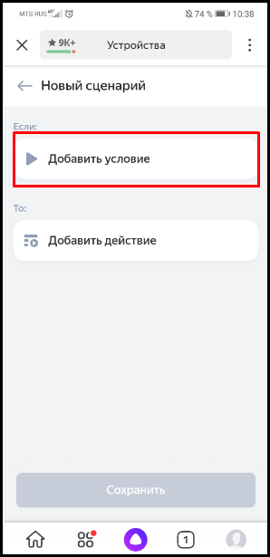
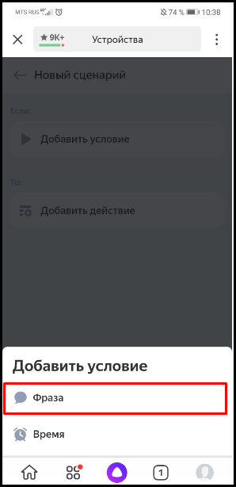
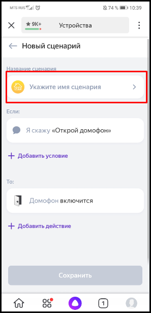
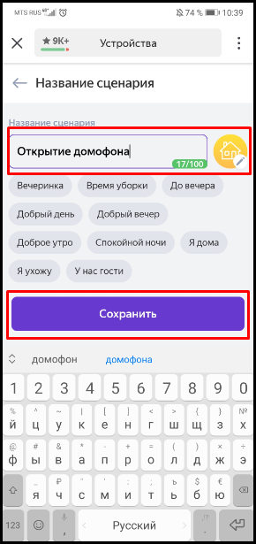
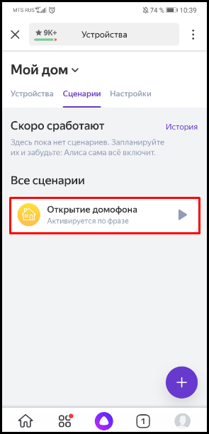
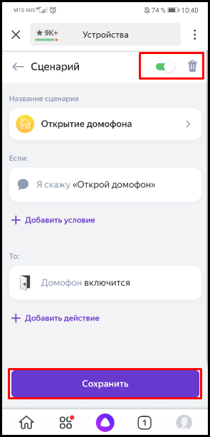
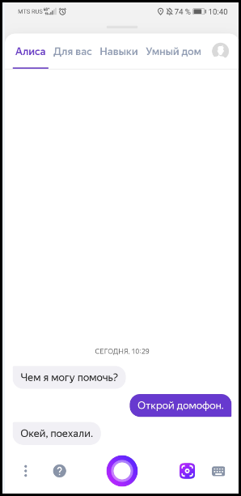

#### Добавление в Устройства Умного дома Яндекс

Для возможности управления домофоном через голосового помощника Алиса подключенное устройство необходимо добавить в Устройства Яндекс. Для этого выполняем следующие действия:

1. В Приложении Яндекс авторизуемся в учетной записи, в которой вы авторизовались ранее на сервисе cloud.evision.tech.  

2. В сервисах Яндекса выбираем Устройства.  

.png)

3. Нажимаем на кнопку **Подключить** умные устройства.

.png)

4. В поисковой строке вводим **Evision** и в результатах поиска выбираем **Устройства eVision** .  

.png)

5. В открывшемся окне нажимаем кнопку **Обновить список устройств**.  

.png)

6. После подключения найденных устройств нажимаем кнопку **Далее** для их настройки:  
   - Определить дом, в котором будет работать устройство  
   - Определить комнату, в которой будет работать устройство  
   - Переименовать, если это необходимо  
   - Устройство добавлено в Умный дом Яндекса.  

.png)

.png)

.png)

.png)

Теперь вы можете открывать импользовать устройства для работы с голосовыми командами "Умный дом Яндекса".  

#### Добавление сценария

Имеется возможность добавления своих сценриев.  Для этого выполняем следующие действия:

1. Не выходя из **Устройства** нажимаем на кнопку "Сценарий".

2. Откроется вкладка с имеющимися сценариями, так как у нас ещё нет созданных сценариев нам нужно их сохдать. Для этого нажмаем на кнопку **Добавления сценариев**.

3. Открывается вкладка для настройки нового сценария. Выбираем **Добавить условие**.

4. Предоставляется на выбор два условия срабатывания сценария, после определенной фразы или после заданного нами времени. Выбираем пункт **Фраза**.

5. Вводим фразу, после которой будет срабатывать наш сценарий и нажимаю кнопку **Добавить**.

6. Далее нажимаем кнопку **Добавить действие**.

7. Появляется список имеющихся устройств, которые могут быть использованы в нашем сценарии. Нажимаем на выбиранное устройство.

8. Появляется список действий (Выключить/Включить) которые произойдут при активации сценария. Выбираем то действие, которое нам нужно и нажимаем **Далее**.

9. Нас переводит на главную страницу. Нажимаем на кнопку **Укажите имя сценария**.

10. Вводим имя нашего сценария и нажимаем **Сохранить**.

11. Нажимаем кнопку **Сохранить** ещё раз, чтобы сохранить созданный нами сценарий.

12. Теперь в нашем списке появился созданный нами сценарий. Для того, чтобы его изменить нашимаем на него.

13. Открывается вкладка настроек сценария. В ней можно: 

- выключить сценарий;  
- удалить сценарий;  
- изменить "Название сценария";  
- изменить условие выполнения сценария;  
- изменить действия которые будет выполнять сценарий;  
- сохранить внесенные изменения  в сценарии

14. Для запуска сценария открываем **Голосовой помошник Алиса**.

15. Проговариваем фарзу которую мы выбрали для запуска нашего сценария "Открой домофон". 

Созданный нами сценарий сработал и открыл дверь домофона. По такому же принципу можно создавать сценарии для других устрйоств.