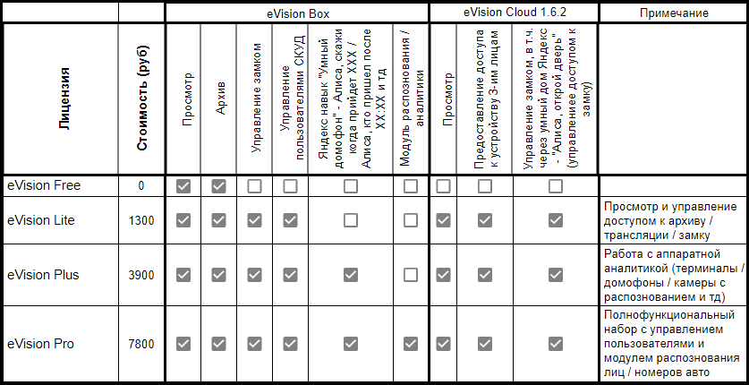

Начиная с версии 1.6.2 в eVision Cloud реализованы следующие типы лицензий:

- Free - бесплатная лицензия, включающая в себя просмотр видеопотока с камер  
- Lite - лицензия, включающая в себя просмотр видеопотока, управление замком  
- Plus - лицензия, включающая в себя просмотр видеопотока, управление замком, аппаратная видеоаналитика, на устройствах Beward TFR, Яндекс навый "Умный домофон"*  
- Pro - лицензия, включающая в себя просмотр видеопотока, управление замком, аппаратная видеоаналитика, на устройствах Beward TFR, Яндекс навый "Умный домофон"**, а также видеоаналитика в eVision Box 

*- В Яндекс навыке "Умный домофон" доступны команды: Алиса, скажи когда придет ###Имя пользователя###; Алиса, кто пришел (в том числе с указанием времени)  

**- В Яндекс навыке "Умный домофон" доступны команды: Алиса, открой дверь; Алиса, скажи когда придет ###Имя пользователя###; Алиса, кто пришел (в том числе с указанием времени)  

