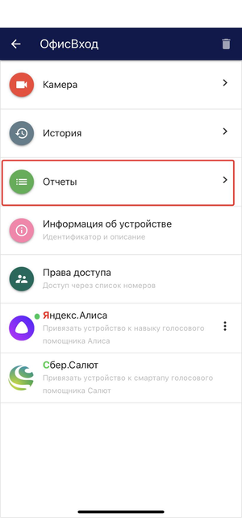
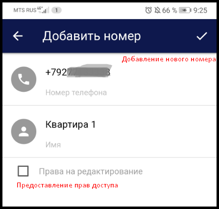

В добавленном устройстве доступен следующий функционал: 

  **Камера.** При переходе на данную вкладку открывается просмотр видео с камеры устройства. На экране просмотра также доступна кнопка электронного ключа, позволяющая открывать замок из приложения.

.png)  **История.** При переходе на данную вкладку открывается история действий связанных с этим устройством.

.png)  **Отчеты.** При переходе на данную вкладку открывается отчет по персонам.

.png)  **Информация об устройстве.** При нажатии раскрывается список из следующих полей: Идентификатор, наименование, тип и описание устройства, параметры сетевого подключения и лицензионный ключ.

.png)  **Права доступа.** Добавление новых и редактирование списка существующих номеров телефонов, кому предоставлен доступ на просмотр и редактирование устройства. 

.png)  **Яндекс.Алиса.** Привязка устройства к навыку Умный домофон голосового помощника Алиса.

.png)  **Салют.** Привязка устройства к навыку Умный домофон голосового помощника Салют.

.png) Устройство также можно удалить, нажав на кнопку.

### История

Для того чтобы посмотреть историю действий связанных с устройством нажимаем на кнопку **История**.

После чего откроется вкладка содержащая список из:  
- имя пользователя  
- совершенное действие  
- время действия  

.png)

Для того, чтобы посмотреть историю действий за предыдущие даты, переключаемся при помощи стрелочек (влево и вправо).  
По центру написана дата за которую отображается история действий.  

.png)

### Отчет

Для того чтобы посмотреть отчет по персонам нажимаем на кнопку **Отчет**.

После чего откроется вкладка содержащая список из:  
- имя пользователя  
- общее время  
- время действия  

.png)

Для того, чтобы посмотреть отчет по персонам за предыдущие даты, переключаемся при помощи стрелочек (влево и вправо).  
По центру написана дата за которую отображается отчет.  

### Информация об устройстве

При нажатии на вкладку Информация об устройстве раскрывается список из следующих полей:  
**Идентификатор устройства** - не редактируемый параметр. Формируется автоматически при добавлении устройства в сервис.  
**Название** и **описание устройства**, а также параметры сетевого подключения (IP-адрес, логин/пароль) - редактируемые поля.  
**Модель устройства** - параметр который можно изменить, нажав на него и выбрав вашу модель устройства из поддерживаемых eVision Cloud.  
**Лицензионный ключ** - не редактируемый параметр. Отображается идентификатор лицензионного ключа, который вводится при добавлении устройства на сервис и тип лицензии (Lite, Plus, Pro).

 

### Права доступа

Если вы являетесь владельцем устройства (добавили его под своей учетной записью), то вы можете добавлять пользователей с разными типами доступа:  
- только на просмотр;  
- с возможностью редактирования.

Добавление новых пользователей происходит путем нажатия на кнопку **Права доступа**.

.png) 

.png)

 

После добавления всех необходимых номеров у вас сформируется список телефонных номеров, кому предоставлен доступ. 

 

.png)**Право на редактирование предоставлено.** Все пользователи, которые  были добавлены с возможностью прав на редактирование, будут отображаться таким образом. Пользователю доступно изменять параметры устройства, включая настройки сетевого подключения.

.png)**Право на редактирование не предоставлено.** В таком режиме пользователю доступен только просмотр  видео с подключенного устройства и возможность удаленного открытия замка по кнопке из приложения. 

.png)**Удаление пользователя.** Нажимая на корзину, вы удаляете доступ пользователя к подключенному устройству. 