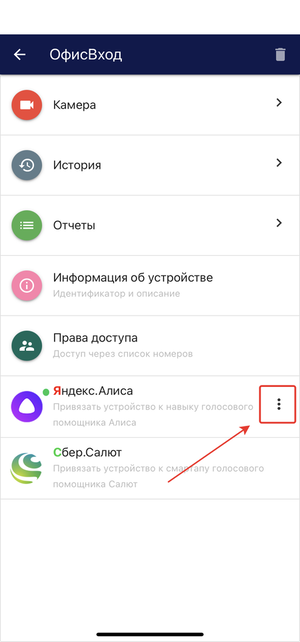

### Навык Умный домофон 

Управление устройствами с помощью голоса доступно также и с использованием навыка Умный домофон ([ссылка](https://salute.sber.ru/)), который позволяет выполнять команду “открой дверь” и отвечать на вопросы кто и когда пришел.  
Для привязки устройства к навыку необходимо использовать специальный идентификатор. Далее- скриншот

.png)

После привязки устройства будет доступен следующий функционал:  
1. Открытие двери (для устройств, добавленных через видеосервер eVision и непосредственно через сервис eVision Cloud);  
2. Отвечать на следующие вопросы (для устройств, добавленных через сервер eVision и включенной видеоаналитикой на данном устройстве):  

- **когда пришел <Имя пользователя>?**  
Ответ Алисы: Первая запись о появлении пользователя на устройстве. 
Если пользователя нет в Базе, то информационное сообщение: “Информация по этому пользователю не найдена” 
Если записи о пользователе за сегодняшний день нет, то информационное сообщение:  “Информация по этому пользователю не найдена” .
Навык также поддерживает сохранение контекста в запросах, например сможет ответить на вопросы:  
  - А вчера?  
   Ответ Алисы: Первая запись о появлении пользователя на устройстве вчера.  
  - А пользователь <Имя пользователя 2>?  
   Ответ Алисы: Первая запись о Пользователе 2 на устройстве вчера.  

- **кто пришел?**  
Ответ Алисы: Список всех зарегистрированных пользователей, идентифицированных eVision за последние 2 мин. и отраженных в отчете по персонам в eVision Cloud.
Если в течение 2 минут ни один пользователь из базы не был идентифицирован, то информационное сообщение: “Сейчас никого нет”.  

- **кто пришел после <Время в 24-часовом формате>?**  
Ответ Алисы:  Список всех зарегистрированных пользователей, идентифицированных eVision и отраженных в отчете по персонам в eVision Cloud за период времени с указанного в запросе до момента запроса.
С предложением перечислить всех.
При согласии на предложение перечислить всех, Ассистент проговаривает всех пользователей, кто был идентифицирован в указанный промежуток времени.
Если в указанный промежуток времени никто не приходил, то информационное сообщение: “после <Время в 24-часовом формате> никто не приходил”.  

- **кто пришел до <Время в 24-часовом формате>?**  
Ответ Алисы:  Список всех зарегистрированных пользователей, идентифицированных eVision и отраженных в отчете по персонам в eVision Cloud с начала дня (00:00) до указанного в запросе времени.
С предложением перечислить всех.

- **кто пришел первый?**  
Ответ: Первый пользователь, идентифицированный eVision за сегодняшний день и отраженный в отчете по персонам в eVision.Cloud на первой позиции.
  
- **кто пришел последний?**  
Ответ: Последний  пользователь, идентифицированный eVision за сегодняшний день и отраженный в отчете по персонам в eVision.Cloud на последней  позиции на момент запроса. 
   
- **кто пришел N-ый?**  
Ответ: N-ный пользователь, идентифицированный eVision за сегодняшний день и отраженный в отчете по персонам в eVision.Cloud на N-ной  позиции на момент запроса.    

При согласии на предложение перечислить всех, Ассистент проговаривает всех пользователей, кто был идентифицирован в указанный промежуток времени.
Если в указанный промежуток времени никто не приходил, то информационное сообщение: “до <Время в 24-часовом формате> никто не приходил”.

Также эти вопросы можно задавать, не проваливаясь в навык, а спрашивая у него, например:  
- **“Алиса, попроси навык умный домофон открыть дверь”**  
или  
- **“Алиса, попроси навык умный домофон” сообщить когда пришел <Имя пользователя>**  

.png)

После активации навыка **Умный домофон**, при нажатии на кнопку "троеточие" в eVision Cloud можно посмотреть устройства на которых подключен навык Алисы.

.png)