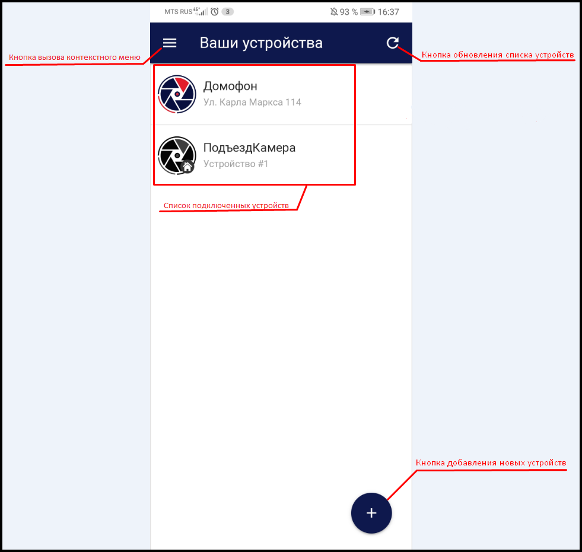

 

В верхней части экрана расположена кнопка вызова контекстного меню:

  

при нажатии на которую открывается  поле с информацией о текущей **версии сервиса eVision Cloud**, кнопка перехода к **списку подключенных устройств**, **идентификатор пользователя** (в данном случае это номер телефона) и **кнопка выхода**:

.png) 

В основном окне отображается список подключенных устройств:

Иконка, которая отображает устройства, подключенные непосредственно к eVision Cloud:

.png)  

Иконка для устройств, подключенных через сервер видеонаблюдения eVision:

.png) 

Активная кнопка удаленного открытия замка, позволяющая открывать домофон из веб-интерфейса приложения:

.png) 

Неактивная кнопка удаленного открытия замка, позволяющая открывать домофон из веб-интерфейса приложения:

.png) 

В нижней части экрана находится кнопка для добавления новых устройств:

.png) 

