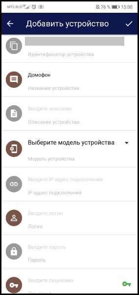
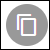
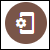
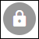
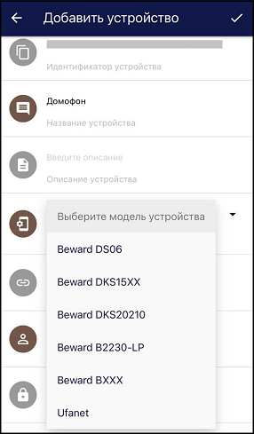
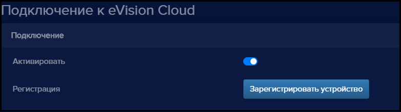

Есть два способа добавления новых устройств:   
- через сервер eVision Cloud;
- через сервер видеонаблюдения eVision Box.

#### Добавление устройства из приложения eVision Cloud

Для добавления нового видеоустройства необходимо иметь следующую информацию:  
- IP адрес устройства;
- логин и пароль для подключения;
- лицензию eVision Cloud.

IP-адрес, логин и пароль можно получить у администратора вашей сети или в документации к устройству. 

**!** Для корректного подключения видеоустройства к приложению eVision Cloud оно должно иметь внешний IP-адрес. В настройках параметров сетевого соединения должна быть настроена переадресация портов (порт данных, HTTP и ONVIF порты) и прописан UPnP-сервер. Функция переадресации портов работает в том случае, когда она включена и поддерживается на вашем маршрутизаторе.

В версии eVision Cloud 1.8 для подключения через веб-интерфейс доступны следующие модели оборудования:  
- одноабонентская вызывная панель Beward DS06;
- многоабонентская вызывная панель Beward DKS 15XX;
- многоабонентская вызывная панель Beward DKS20210;
- многоабонентская вызывная панель Beward B2230-LP; 
- многоабонентская вызывная панель Beward BXXX;
- Ufanet.

Чтобы добавить новое видеоустройство, нажмите кнопку **Добавить устройство** в правой нижней части экрана:

 

Откроется окно **Добавить устройство** с полями, которые необходимо заполнить:

**Идентификатор устройства**. Поле заполняется автоматически. Идентификатор устройства представляет собой уникальную цифро-буквенную комбинацию:

 

**Наименование устройства.** Устройство лучше называть в одно слово, так как в последующем оно будет устройством Умного дома:

 

**Модель устройства.** При нажатии появится список доступных типов оборудования:

 

**Описание устройства.** Краткое описание подключаемого устройства. Рекомендуем указывать адрес местоположения устройства:

 

**IP адрес.** Адрес устройства, по которому оно доступно извне. Адрес указывается в следующем формате: http://77.88.55.50:82:

 

**Логин.** Имя пользователя на подключаемом устройстве. По умолчанию - admin:

 

**Пароль.** Пароль на подключаемом устройстве. По умолчанию - admin:

 

**Лицензия.**  Поле для ввода лицензионного ключа.  
**!** Если к вашему номеру телефона уже были привязаны лицензии, их можно выбрать, нажав на зеленый ключик рядом с полем **Лицензия**:

 

Указываем наименование устройства и добавляем описание, далее выбираем необходимый тип оборудования из списка доступных. Поле идентификатор устройства заполняется автоматически, его редактировать не нужно:

Прописываем настройки сетевого подключения и логин/пароль от вызывной панели: 

.png)

Добавляем лицензионный ключ в соответствующее поле. При корректном вводе ключа вы увидите сообщение о том, что лицензия успешно активирована:

.png)

После заполнения всех необходимых полей необходимо сохранить и применить настройки подключения устройства:

.png)

После сохранения в общем списке добавится подключаемое устройство:

.png)

#### Добавление устройства через сервер видеонаблюдения eVision 

После добавления устройства на сервер видеонаблюдения eVision ([Руководство пользователя eVision](https://docs.evision.tech/04-v3.8.0 )), его можно подключить к сервису eVision Cloud.  

**!**Для активации данного функционала необходима лицензия eVision:

При включении **Активировать** появляется возможность транслировать видео с данного устройства в сервис eVision.Cloud. 

Кнопка **Зарегистрировать устройство** открывает браузер со страницей авторизации на сервисе.

Устройство, добавленное через eVision, отображается иконкой:

 