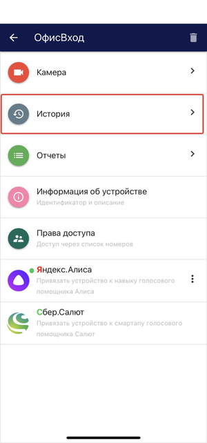
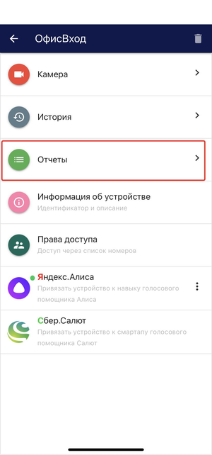
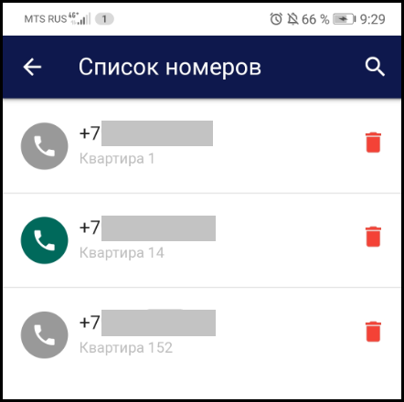

В добавленном устройстве доступен следующий функционал: 

**Камера.** При переходе на данную вкладку открывается просмотр видео с камеры устройства. На экране просмотра также доступна кнопка электронного ключа, позволяющая открывать замок из приложения:

  

**История.** При переходе на данную вкладку открывается история действий, связанных с этим устройством:

.png)  

**Отчеты.** При переходе на данную вкладку открывается отчет по персонам:

.png)  

**Информация об устройстве.** При нажатии раскрывается список из следующих полей: Идентификатор, Наименование, Тип и описание устройства, Параметры сетевого подключения и Лицензионный ключ:

.png)  

**Права доступа.** Добавление новых и редактирование списка существующих номеров телефонов, кому предоставлен доступ на просмотр и редактирование устройства:

.png)  

**Яндекс.Алиса.** Привязка устройства к навыку Умный домофон голосового помощника Алиса:

.png)  

**Салют.** Привязка устройства к навыку Умный домофон голосового помощника Салют:

.png)  

Устройство также можно удалить, нажав на кнопку с изображением корзины:

.png) 

### История

Чтобы посмотреть историю действий, связанных с устройством, нажимаем на кнопку **История**:

Откроется вкладка, содержащая список из:  
- имени пользователя; 
- совершенного действия;  
- времени действия. 

.png)

Xтобы посмотреть историю действий за предыдущие даты, переключаемся при помощи стрелочек (влево и вправо). По центру написана дата за которую отображается история действий: 

.png)

### Отчет

Чтобы посмотреть отчет по персонам, нажимаем на кнопку **Отчет**:

Откроется вкладка, содержащая список из:  
- имени пользователя;
- общего времени; 
- времени действия.

.png)

Чтобы посмотреть отчет по персонам за предыдущие даты, переключаемся при помощи стрелочек (влево и вправо). По центру написана дата, за которую отображается отчет.  

### Информация об устройстве

При нажатии на вкладку **Информация об устройстве** раскрывается список из следующих полей:  
- **Идентификатор устройства** - нередактируемый параметр. Формируется автоматически при добавлении устройства в сервис.  
- **Название** и **Описание устройства** - редактируемые поля.  

.png) 

### Права доступа

Если вы являетесь владельцем устройства (добавили его под своей учетной записью), то можете добавлять пользователей с разными типами доступа:  
- только на просмотр;  
- с возможностью редактирования.

Добавление новых пользователей происходит путем нажатия на кнопку **Права доступа**.

.png) 

.png)

После добавления всех необходимых номеров у вас сформируется список телефонных номеров, кому предоставлен доступ:

 

**Право на редактирование предоставлено:** 

.png)

Все пользователи, которые  были добавлены с возможностью прав на редактирование, будут отображаться таким образом. Пользователю доступно изменять параметры устройства, включая настройки сетевого подключения.

**Право на редактирование не предоставлено:** 

.png)

В таком режиме пользователю доступен только просмотр видео с подключенного устройства и возможность удаленного открытия замка по кнопке из приложения. 

**Удаление пользователя:** 

.png)

Нажимая на корзину, вы удаляете доступ пользователя к подключенному устройству. 