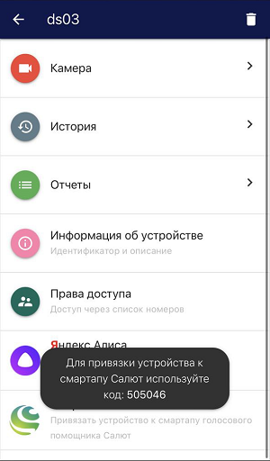

### Навык Умный домофон  в Салюте

Управление устройствами с помощью голоса доступно также и с использованием навыка Умный домофон ([ссылка](https://salute.sber.ru/)), который позволяет выполнять команду “открой дверь”, отвечать на вопросы "кто и когда пришел" и выводить изображение с камеры на устройства с поддержкой Сбер.

Для привязки устройства к навыку необходимо использовать специальный идентификатор, который представляет собой числовую последовательность (пример идентификатора можно увидеть на скриншоте ниже):

После привязки устройства будет доступен следующий функционал:  
1. Открытие двери (для устройств, добавленных через видеосервер eVision и непосредственно через сервис eVision Cloud). 
2. Вывод изображения с камеры на устройства с поддержкой Сбер.
3. Ответы на следующие вопросы (для устройств, добавленных через сервер eVision с включенной видеоаналитикой на данном устройстве):  

- **Когда пришел <Имя пользователя>?**  

Ответ Салюта: Первая запись о появлении пользователя на устройстве. 

Если пользователя нет в базе, то информационное сообщение: “Информация по этому пользователю не найдена”.

Если записи о пользователе за сегодняшний день нет, то информационное сообщение:  “Информация по этому пользователю не найдена” .

Навык также поддерживает сохранение контекста в запросах, например сможет ответить на вопросы:  

  - **А вчера?** 

Ответ Салюта: Первая запись о появлении пользователя на устройстве вчера. 

  - **А пользователь <Имя пользователя 2>?** 

Ответ Салюта: Первая запись о Пользователе 2 на устройстве вчера.  

- **Кто пришел?**  

Ответ Салюта: Список всех зарегистрированных пользователей, идентифицированных eVision за последние 2 мин. и отраженных в отчете по персонам в eVision Cloud.

Если в течение 2 минут ни один пользователь из базы не был идентифицирован, то информационное сообщение: “Сейчас никого нет”.  

- **Кто пришел после <Время в 24-часовом формате>?**  

Ответ Салюта:  Список всех зарегистрированных пользователей, идентифицированных eVision и отраженных в отчете по персонам в eVision Cloud за период времени с указанного в запросе до момента запроса. С предложением перечислить всех. 

При согласии на предложение перечислить всех, ассистент проговаривает всех пользователей, кто был идентифицирован в указанный промежуток времени. 

Если в указанный промежуток времени никто не приходил, то информационное сообщение: “После <Время в 24-часовом формате> никто не приходил”.  

- **Кто пришел до <Время в 24-часовом формате>?**  

Ответ Салюта:  Список всех зарегистрированных пользователей, идентифицированных eVision и отраженных в отчете по персонам в eVision Cloud с начала дня (00:00) до указанного в запросе времени. С предложением перечислить всех. 

При согласии на предложение перечислить всех, ассистент проговаривает всех пользователей, кто был идентифицирован в указанный промежуток времени. 

Если в указанный промежуток времени никто не приходил, то информационное сообщение: “До <Время в 24-часовом формате> никто не приходил”.

- **Кто пришел первый?** 
 
Ответ Салюта: Первый пользователь, идентифицированный eVision за сегодняшний день и отраженный в отчете по персонам в eVision.Cloud на первой позиции.
  
- **Кто пришел последний?**  

Ответ Салюта: Последний  пользователь, идентифицированный eVision за сегодняшний день и отраженный в отчете по персонам в eVision.Cloud на последней позиции на момент запроса. 
   
- **Кто пришел N-ый?** 
   
Ответ Салюта: N-ный пользователь, идентифицированный eVision за сегодняшний день и отраженный в отчете по персонам в eVision.Cloud на N-ной позиции на момент запроса.

Также эти вопросы можно задавать, не проваливаясь в смартап, а спрашивая у него:  

- **Салют, попроси навык Умный домофон открыть дверь**.  
- **Салют, попроси навык Умный домофон сообщить, когда пришел <Имя пользователя>**.   
- **Салют, покажи камеру**.  

Интерфейс приложения "Салют" со смартапом eVision, в котором возможно управление входными устройствами и камерами с помощью семейства ассистентов Салют:

.png)

