#### Добавление в Устройства Умного дома Яндекс

Для возможности управления домофоном через голосового помощника Алиса подключенное устройство необходимо добавить в устройства Умного дома Яндекс. 

**Список поддерживаемых устройств:** 
Beward DS03, Beward DS06, Beward DKS15122, Beward DKS20210 и Beward TFR 50-202. 

Для этого выполняем следующие действия:

1. В приложении "Яндекс" авторизуемся в учетной записи, в которой авторизовались ранее на сервисе cloud.evision.tech.  

2. В сервисах Яндекс выбираем Устройства.  

.png)

3. Нажимаем на кнопку **Подключить** умные устройства.

.png)

4. В поисковой строке вводим **Evision** и в результатах поиска выбираем **Устройства eVision** .  

.png)

5. В открывшемся окне нажимаем кнопку **Обновить список устройств**.  

.png)

6. После подключения найденных устройств нажимаем кнопку **Далее** для их настройки:  
   - определить дом, в котором будет работать устройство;  
   - определить комнату, в которой будет работать устройство;  
   - переименовать, если это необходимо;  
   - устройство добавлено в Умный дом Яндекс. 

.png)

.png)

.png)

.png)

Теперь есть возможность использовать устройство для работы с голосовыми командами в умном доме "Яндекс". 

#### Добавление сценария

Для управления голосом создайте свой сценарий. Для этого выполняем следующие действия:

1. Не выходя из **Устройства**, нажимаем на кнопку "Сценарии".

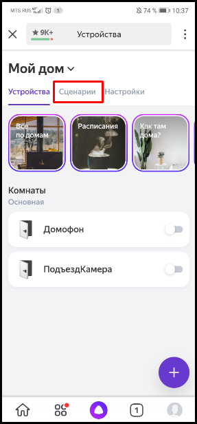

2. Откроется вкладка с имеющимися сценариями. У нас ещё нет созданных сценариев, нужно их создать. Нажимаем на кнопку **добавления сценариев**.

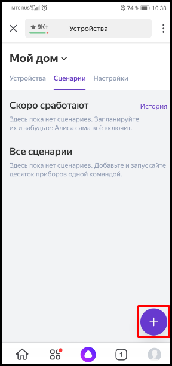

3. Откроется вкладка для настройки нового сценария. Выбираем **Добавить условие**.

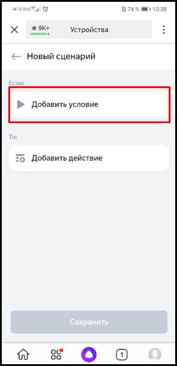

4. Предоставляется на выбор два условия срабатывания сценария: после определенной фразы или после заданного нами времени. Выбираем пункт **Фраза**.

5. Вводим фразу, после которой будет срабатывать сценарий, и нажимаем кнопку **Добавить**.

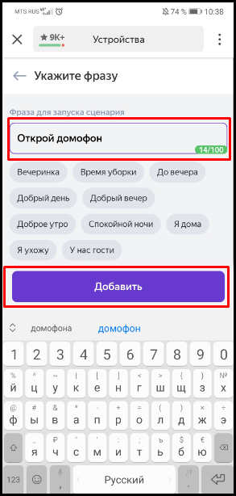

6. Далее нажимаем кнопку **Добавить действие**.

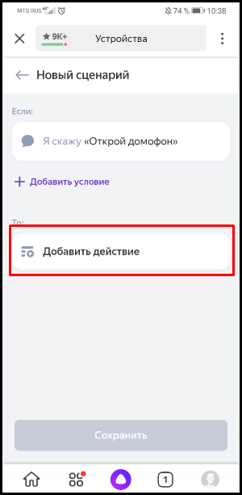

7. Появляется список имеющихся устройств, которые могут быть использованы в сценарии. Нажимаем на выбранное устройство.

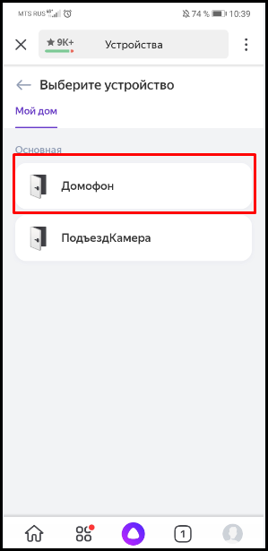

8. Появляется список действий (Выключить/Включить), которые произойдут при активации сценария. Выбираем нужное действие и нажимаем **Далее**.

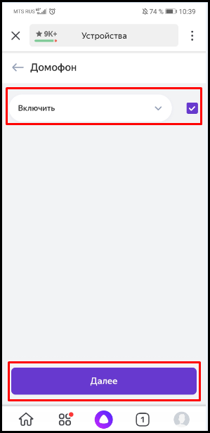

9. Нас переводит на главную страницу. Нажимаем на кнопку **Укажите имя сценария**.

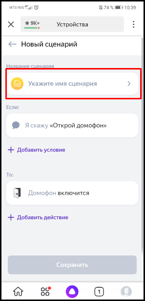

10.  Вводим имя сценария и нажимаем **Сохранить**.

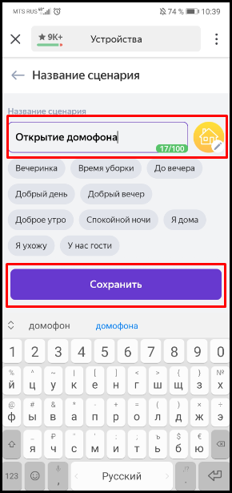

11.  Нажимаем кнопку **Сохранить** ещё раз, чтобы сохранить созданный сценарий.

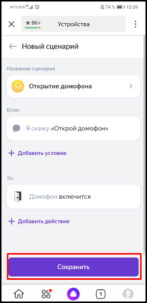

12.  Теперь в списке появился созданный сценарий. Чтобы его изменить, нажимаем на него.

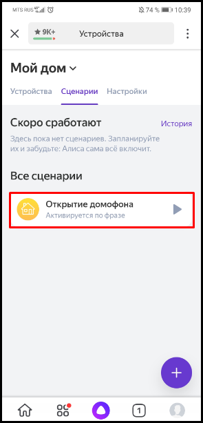

13. Открывается вкладка настроек сценария. В ней можно: 

- выключить сценарий;  
- удалить сценарий;  
- изменить "Название сценария";  
- изменить условие выполнения сценария;  
- изменить действия, которые будет выполнять сценарий;  
- сохранить внесенные изменения  в сценарии

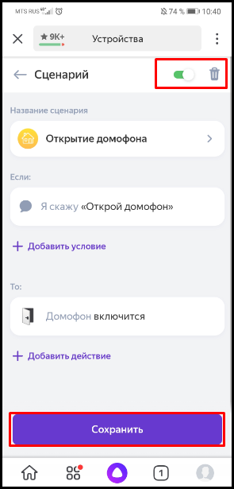

14. Для запуска сценария открываем **Голосовой помощник Алиса**.

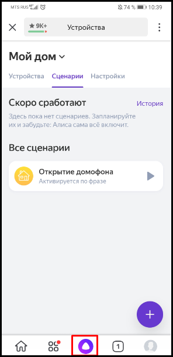

15.  Проговариваем фразу, которую мы выбрали для запуска сценария "Открой домофон". 

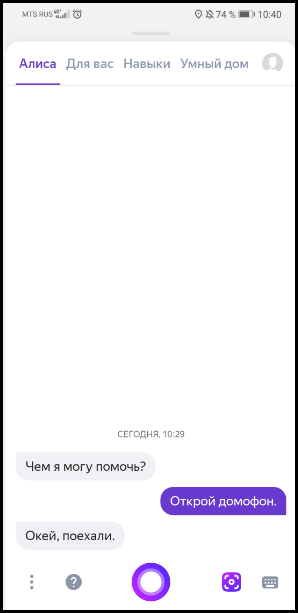

Созданный сценарий сработал и открыл замок, который управляет домофоном. По такому же принципу можно создавать сценарии для других устройств.