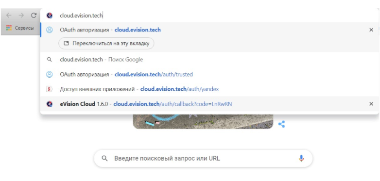

#### Запуск сервиса

1. Для запуска сервиса eVision Cloud следует ввести адрес https://cloud.evision.tech/ в адресное поле интернет-браузера и перейти по нему.

.png)

2. В поле ввода номера телефона введите свой номер телефона начиная с +7 и нажмите кнопку "Далее". 

.png)

3. После нажатия на кнопку "Далее" появится поле для ввода кода подтверждения. В течении 5-10 секунд на ваш номер телефона будет произведен звонок.  
Последние четыре цифры номера звонящего являются кодом доступа для вашей авторизации на сервисе eVision Cloud. Например в нашем случае 6613.

.png)

4. Водим последние четыре цифры в поле для **Ввода кода подтверждения** и нажимаем кнопку **Войти**.

.png)

открывается eVision Cloud в котором вы авторизовались.

.png)