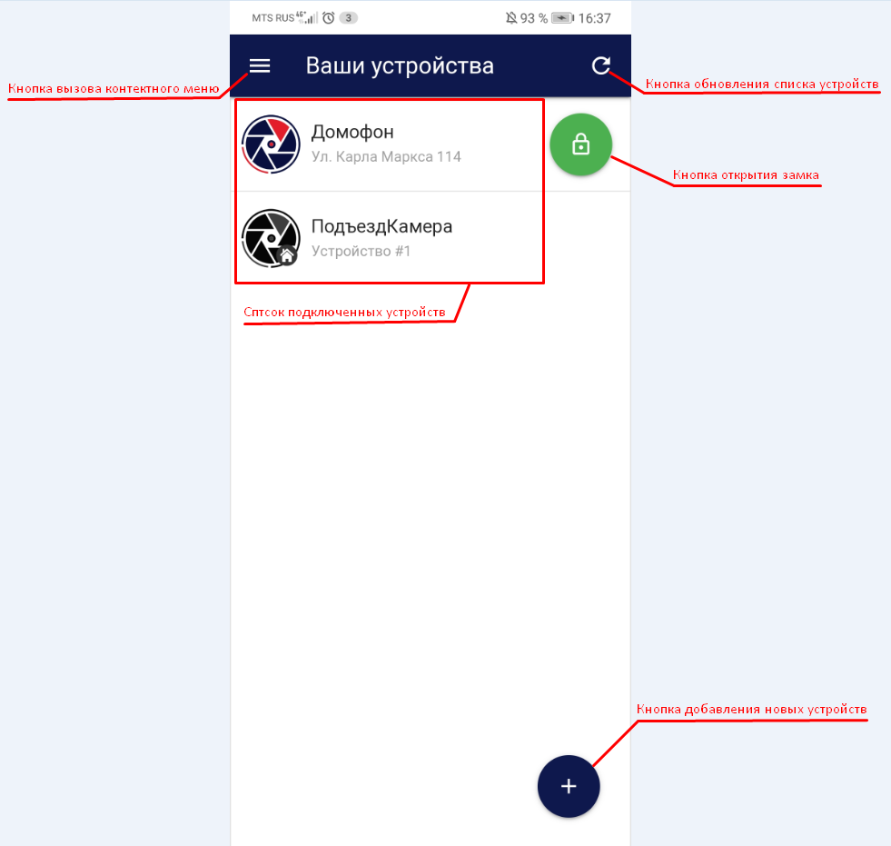

 

В верхней части экрана расположена:

Кнопка вызова контекстного меню, при нажатии на которую открывается  меню с информацией о версии eVision Cloud, кнопка перехода к списку **Выших устройств**, номер телефона пользователя и кнопка выхода из авторизации приложения.

.png) 