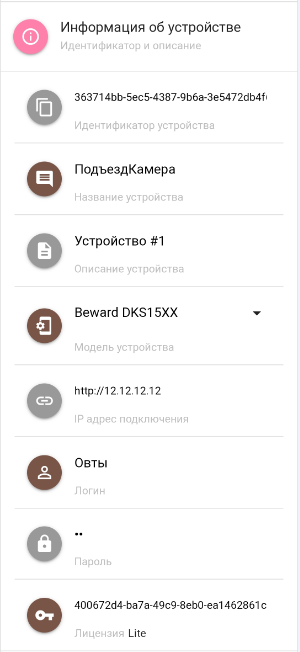
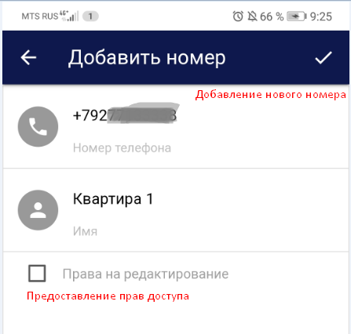
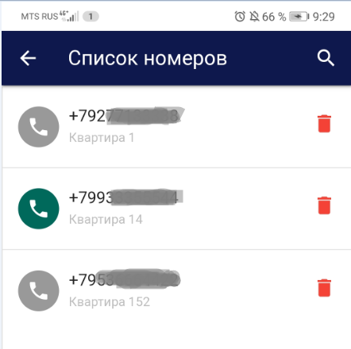
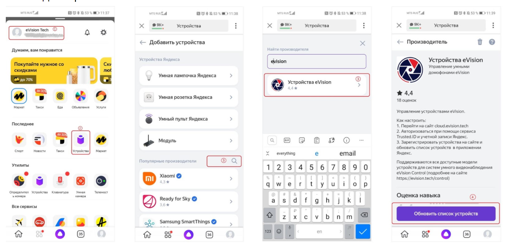

В добавленном устройстве доступен следующий функционал: 

  **Камера.** При переходе на данную вкладку открывается просмотр видео с камеры устройства. На экране просмотра также доступна кнопка электронного ключа, позволяющая открывать замок из приложения.

.png)  **История.** При переходже на данную вкладку открывается история действий связанных с этим устройством.

.png)  **Отчеты.** При переходе на данную вкладку открывается отчет по персонам.

.png)  **Информация об устройстве.** При нажатии раскрывается список из следующих полей: Идентификатор, наименование, тип и описание устройства, параметры сетевого подключения и лицензионный ключ.

.png)  **Права доступа.** Добавление новых и редактирование списка существующих номеров телефонов, кому предоставлен доступ на просмотр и редактирование устройства. 

.png)  **Яндекс.Алиса.** Привязка устройства к навыку Умный домофон голосового помощника Алиса.

.png) Устройство также можно удалить, нажав на кнопку.

#### Информация об устройстве

При нажатии на вкладку Информация об устройстве раскрывается список из следующих полей:  
**Идентификатор устройства** - нередактируемый параметр. Формируется автоматически при добавлении устройства в сервис.  
**Название** и **описание устройства**, а также параметры сетевого подключения (IP-адрес, логин/пароль) - редактируемые поля.  
**Модель устройства** - параметр который можно изменить, нажав на него и выбрав вашу модель устройста из поддерживаемых eVision Cloud.  
**Лицензионный ключ** - нередактируемый параметр. Отображается идентификатор лицензионного ключа, который вводится при добавлении устройства на сервис и тип лицензии (Lite, Plus, Pro).

 

#### Права доступа

Если вы являетесь владельцем устройства (добавили его под своей учетной записью), то вы можете добавлять пользователей с разными типами доступа:  
- только на просмотр;  
- с возможностью редактирования.

Добавление новых пользователей происходит путем нажатия на кнопку  

После добавления всех необходимых номеров у вас сформируется список телефонных номеров, кому предоставлен доступ. 

 

.png)**Право на редактирование предоставлено.** Все пользователи, которые  были добавлены с возможностью прав на редактирование, будут отображаться таким образом. Пользователю доступно изменять параметры устройства, включая настройки сетевого подключения.

.png)**Право на редактирование не предоставлено.** В таком режиме пользователю доступен только просмотр  видео с подключенного устройства и возможность удаленного открытия замка по кнопке из приложения. 

.png)**Удаление пользователя.** Нажимая на корзину, вы удаляете доступ пользователя к подключенному устройству. 

#### Добавление в Устройства Умного дома Яндекс

Для возможности управления домофоном через голосового помощника Алиса подключенное устройство необходимо добавить в Устройства Яндекс. Для этого необходимо:

1. В Приложении Яндекс авторизоваться учетной записью, которой вы авторизовались ранее на сервисе cloud.evision.tech.  
2. В сервисах Яндекса выбрать Устройства.  
3. Выбрать устройство eVision из списка устройств сторонних производителей.  
4. Обновить список устройств.  
5. Настроить найденное устройство:  
   - Определить комнату, в которой будет работать устройство  
   - Переименовать, если это необходимо   
   - Устройство добавлено в Умный дом Яндекса.   
6. Теперь Вы можете открывать Домофон голосовой командой: “Алиса, открой домофон”.  

.png)

#### Навык Умный домофон 

Управление устройствами также доступно из навыка Умный домофон Алисы. Но для этого устройство необходимо привязать к навыку с помощью специального идентификатора:  

.png)

После ввода идентификатора в навыке “Умный домофон” будет доступен следующий функционал:  
- открытие двери (для устройств, добавленных через eVision и непосредственно через сервис eVision Cloud);  
- отвечать на вопросы: когда пришел пользователь, кто пришел (для устройств, добавленных через сервер eVision и включенной видеоаналитикой на данном устройстве).  

.png)