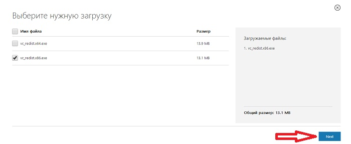

#### Подготовка к работе

##### Требования к оборудованию

Современные камеры обладают различными возможностями и характеристиками, и в зависимости от задачи и условий эксплуатации выбираются необходимые устройства.

##### Требования к камерам

Минимальное разрешение матрицы - 2 мегапикселя
Минимальное разрешение картинки - 640 на 480
Сетевые протоколы - rtsp, http, onvif

При выборе камеры следует отдать предпочтение цилиндрическим или кубическим камерам. В случае использования купольных камер возможны ограничения из-за угла наклона камеры относительно объекта распознавания.

##### Требования к видеодомофонам

Минимальное разрешение матрицы - 2 мегапикселя
Минимальное разрешение картинки - 640 на 480
Сетевые протоколы - rtsp, http, onvif, sip
Встроенный динамик

##### Требования к размещению камер

Для корректного распознавания лиц видеоустройства необходимо располагать так, чтобы при нахождении человека перед камерой взгляд человека был направлен прямо в объектив. Расстояние от устройства до объекта распознавания зависит от наличия автофокусировки. К примеру видеодомофон устанавливают так, чтобы расстояние между камерой видеодомофона и объектом распознавания было 1-2 метра.

##### Освещение

Освещение должно быть достаточным для распознавания цветного изображения с камеры. Распознавание при ночной съемке также будет работать, однако для более точной работы необходимо добавление пользователям снимков в черно\белом спектре.

#### Установка eVision
##### Получение и установка пакета VCredist.exe

Перед установкой eVision на Windows 10  необходимо установить распространяемый пакет Visual C++ для Visual Studio 2015 для корректной работы программы.  Перейдя по [https://www.microsoft.com/ru-ru/download/details.aspx?id=48145](https://www.microsoft.com/ru-ru/download/details.aspx?id=48145), нажмите *Cкачать*.

Затем в зависимости от Вашей системы отметьте 32 или 64 битную версию галочкой, нажмите «*Next*».

Запустите скачанный файл vcredist.exe, в итоге откроется окно, в котором нам необходимо ознакомиться и согласиться с условиями лицензионного соглашения и затем нажать «*Установить*».

Начался процесс установки.

По окончанию установки появится соответствующее окно о окончании установки. Нажмите “Закрыть”.

Теперь можно продолжить установку программы **eVision**.

##### Установка eVision для Windows

Скачать установочный файл можно на сайте www.evision.tech в разделе Evision. Или по этой ссылке [https://api.evision.tech/distr/eVision.3.4.0_setup.exe](https://api.evision.tech/distr/eVision.3.4.0_setup.exe)

.png)

Запустите установочный файл, следуйте указаниям мастера установки, при необходимости меняйте язык установки и папку, в которую будет установлен **eVision** на вашем компьютере. 

.png)

.png)

.png)

.png)

.png)

.png)

.png)

.png)

После завершения установки **eVision** будет готов к запуску.

##### Установка eVision для Ubuntu

Для начала работы **eVision** необходимо установить программное обеспечение для быстрого развертывания приложений Docker и Docker-compose для Ubuntu. Подробную инструкцию, как это сделать можно прочитать на сайтах:
<https://totaku.ru/ustanovka-docker-i-docker-compose-v-ubuntu-18-04>

<https://losst.ru/ustanovka-docker-na-ubuntu-16-04>

Инструкция с некоторыми полезными командами Docker:
<https://www.digitalocean.com/community/tutorials/docker-ubuntu-18-04-1-ru>

После установки Docker, скачиваем конфигурационный YML файл текущей версии **eVision** по ссылке: [https://api.evision.tech/distr/docker-compose.yml](https://api.evision.tech/distr/docker-compose.yml).

Для загрузки контейнера **eVision** в папке с конфигурационным файлом в командной строке необходимо выполнить команду:

*docker-compose pull*

Для запуска контейнера **eVision** в папке с конфигурационным файлом в командной строке необходимо выполнить команду:

*docker-compose up*

После запуска данной команды в окне терминала появится логирование событий и состояния **eVision.**

##### Запуск eVision для Windows

Существует несколько вариантов запуска приложения из ярлыка **eVision**, который находится:
|

- на Рабочем столе :
||
| :- | :-: |
|

- в меню **Пуск**.
||

После запуска откроется окно авторизации:

Введите логин и пароль пользователя и нажмите кнопку **Войти**. По умолчанию логин и пароль пользователя с правами администратора: admin/admin.

**!** Для безопасности стандартные логин и пароль администратора рекомендуется поменять. Восстановление утерянных логина и пароля учетной записи администратора  невозможно, сохраните их в безопасном месте.

##### Запуск eVision для Ubuntu

После запуска контейнера **eVision**, откройте браузер и введите в адресной строке:

*localhost:4000*

Откроется окно авторизации. По умолчанию логин и пароль пользователя с правами администратора: admin/admin.

