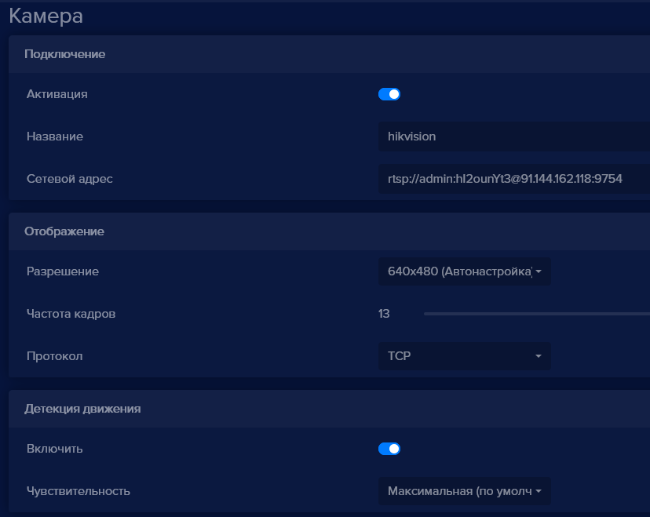
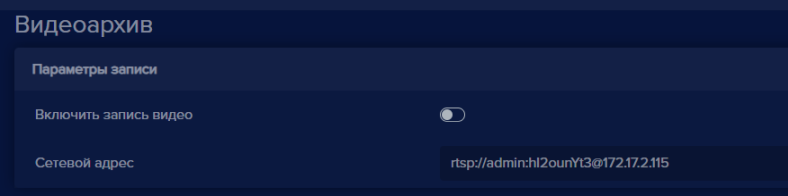
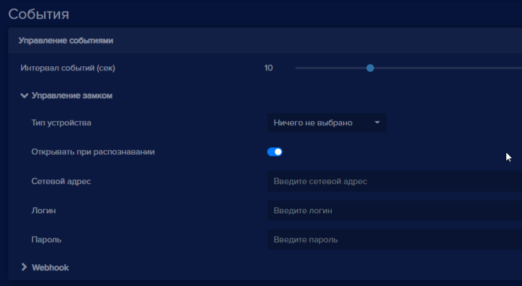
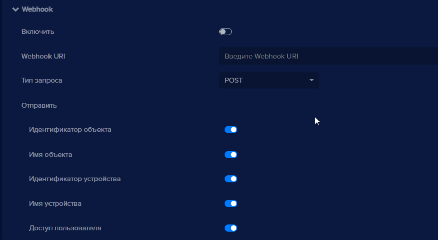
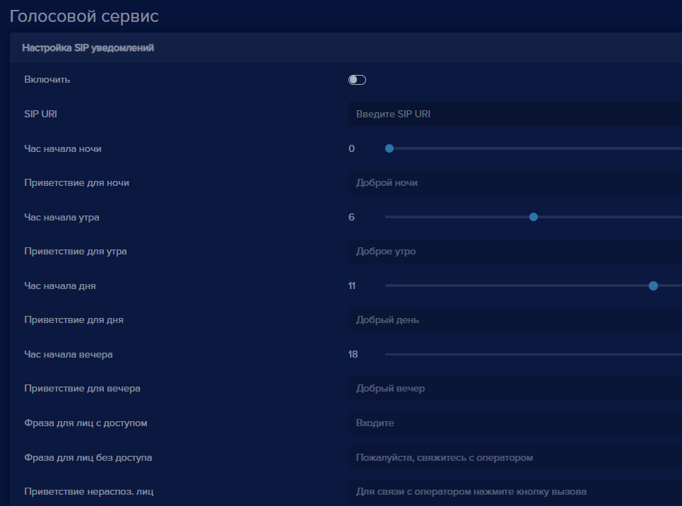
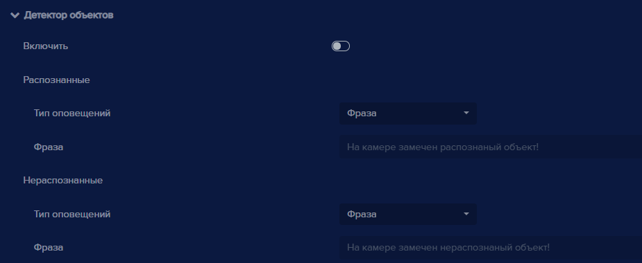
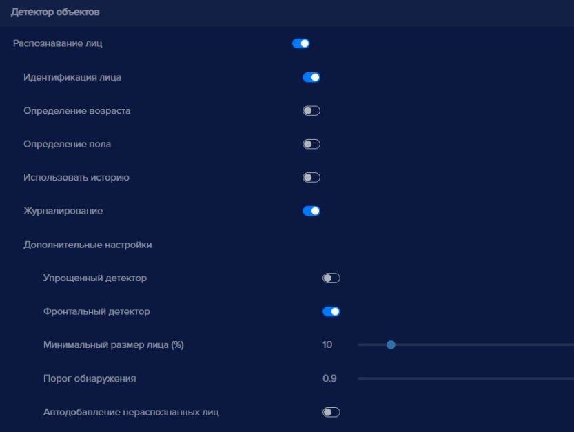
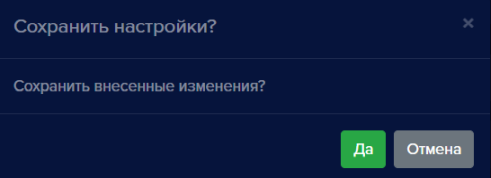

Данный раздел предназначен для ввода лицензионного ключа, настройки параметров видеопотока, настройки видеоаналитики, управления замком, настройки видеоархива, настройки голосовыми уведомлениями и оповещениями, а также для  активации облачного сервиса для устройства.

В настройках содержатся разделы:

- Лицензия
- Камера
- Видеоархив
- События
- Голосовой сервис
- Видеоаналитика
- Подключение к **eVision Cloud**

#### Лицензия
Раздел **Лицензия** необходим для ввода лицензионного ключа. Лицензионный ключ прописывается для каждого устройства. По-умолчанию в **eVision** на одно устройство доступна встроенная лицензия. Встроенная лицензия закрепляется на первом устройстве, добавленном в **eVision**. Срок действия встроенной лицензии 14 дней с момента активации видеоаналитики на устройстве со встроенной лицензией.

#### Камера
Раздел **Камера** содержит настройки видеопотока, разрешения, частоты кадров, сервиса получения снимков по FTP и детектора движения.

Кнопка **Активация** позволяет выключить или включить получение видеопотока с устройства для видеоаналитики.

В поле **Название** указывается наименование устройства.

В поле **Сетевой адрес** указывается путь для получения видеопотока.

В пункте **Разрешение** указывается разрешение, с которым **eVision** получает видеопоток с устройства. Доступные значения: **Original, 320x240, 640x480, 1280x720**. При выборе значения **Original**, **eVision** получает видеопоток с разрешением, указанным в настройках самого устройства.

В пункте **Частота кадров** указывается максимальная частота кадров видеопотока. Доступные значения: от 1 до 25 кадров в секунду. Регулировка выполняется ползунком по шкале.

В пункте **Протокол** выбор транспортного протокола доступны варианты: TCP и UDP.

В блоке **Детекция движения** находится кнопка **Включить** для включения детектора движения.

В пункте **Чувствительность** указывается уровень чувствительности детектора движения. Доступные значения: **Максимальная, Высокая, Средняя, Низкая, Минимальная**.

#### Видеоархив
В разделе **Видеоархив** включается и настраивается путь к видеопотоку, который будет сохраняться на жестком диске. Время хранения видеопотока указывается меню общих настроек. По умолчанию время хранения видео - 30 дней.

Кнопка Включить запись видео - включает запись видеофайлов на жесткий диск.

В поле Сетевой адрес указывается путь для получения видеопотока.
#### События
В разделе **События** содержатся настройки замками, сетевыми реле и запросами webhook.

Содержит несколько предустановленных вариантов оборудования различных производителей, включая сетевые реле и видеоустройства с релейными выходами. А также работу сетевого реле можно настроить вручную, используя распространенные параметры.

В пункте **Интервал событий (сек)** - указывается интервал времени срабатывания замка. 

**Тип устройства** содержит список устройств, для которых в **eVision** сохранены параметры для управления реле различных производителей. Либо для настройки замка вручную.

**Открывать при распознавании** - пункт, который отвечает за срабатывание замка, при распознавании человека с разрешенным доступом.

**Сетевой адрес** - IP адрес устройства

**Логин** - учетная запись для доступа на устройство

**Пароль** - пароль учетной записи для доступа на устройство

**Токен** - ключ для подключения к реле, используется на некоторых устройствах

**Канал** - порядковый номер выхода, используется на некоторых сетевых реле

После заполнения полей, в окне видеопотока появится кнопка **Открыть замок** .

**Webhook**

Раздел для настройки http запросов, которые могут отправляться на указанный адрес сервера при распознавании объекта.

Кнопка **Включить** - для включения сервиса отправки webhook запросов. 

Поле **Webhook URI** - поле для ввода адреса сервера для приема webhook запросов

Пункт **Тип запроса** - список для выбора типа запроса, **POST** или **GET**

**Отправить: Идентификатор объекта, Имя объекта, Идентификатор устройства, Имя устройства, Доступ пользователя** - включает или убирает из запроса выбранную информацию.

#### График работы управления доступом
Служит для настройки рабочего времени устройства. 

**Рабочее время** - указывает диапазон времени для работы видеоаналитики на устройстве.

**Отключать на выходные** - пункт для включения субботы и воскресенья в рабочие дни недели.

#### Голосовой сервис
Раздел, в котором настраиваются уведомления по SIP на устройство и голосовые оповещения для оператора.
#### Настройка SIP уведомлений
Служит для настройки запросов по протоколу SIP на устройство, поддерживающее подключение по SIP с динамиком. Это может быть видеодомофон, который принимает вызовы по SIP в локальной сети или SIP громкоговоритель. 

Кнопка **Включить** - включает или отключает подключение к устройству по протоколу SIP.

Поле **SIP URI** - для ввода SIP запроса, как правило включает в себя имя sip аккаунта и IP адрес устройства (пример: *sip:100@172.17.2.100*).

**Час начала ночи** - переключатель для выбора времени для начала ночи

**Приветствие для ночи** - текст уведомления, которое произносится устройством при распознавании человека ночью

**Час начала утра** - переключатель для выбора времени для начала утра

**Приветствие для утра** - текст уведомления, которое произносится устройством при распознавании человека утром

**Час начала дня** - переключатель для выбора времени для начала дня

**Приветствие для дня** - текст уведомления, которое произносится устройством при распознавании человека днем

**Час начала вечера** - переключатель для выбора времени для начала вечера

**Приветствие для вечера** - текст уведомления, которое произносится устройством при распознавании человека вечером

**Фраза для лиц с доступом** - текст уведомления, которое произносится устройством при распознавании человека, со разрешенным доступом

**Фраза для лиц без доступа** - текст уведомления, которое произносится устройством при распознавании человека, с запрещенным доступом

**Приветствие нераспоз. лиц** - текст уведомления, которое произносится устройством при распознавании человека, которого нет в базе пользователей.

#### Оповещения оператора
В данном разделе настраиваются голосовые оповещения, которые работают в интерфейсе **eVision**.  Существуют два вида оповещения: при появлении движения в кадре и при распознавании пользователя.

**Детектор движения**

В блоке **Детектор движения** содержатся: 

Кнопка **Включить** - позволяет включить или отключить оповещения при срабатывании детектора движения.

Список **Тип оповещений** - позволяет выбрать тип оповещений. Доступны варианты: **Фраза, Звук,  Файл пользователя**.

При выборе **Фраза** будет проигрываться стандартная фраза (“На камере замечено движение”).

При выборе пункта **Звук** будет воспроизведен стандартный звуковой сигнал.

При выборе пункта **Файл** появляется дополнительное поле **Выберите файл** для загрузки аудиофайла с жесткого диска. Если не загружать файл с жесткого диска, то будет проигрываться стандартный звуковой сигнал.

#### Детектор объектов

В блоке **Детектор объектов** содержатся:

Кнопка **Включить** - позволяет включить или отключить оповещения при срабатывании детектора объектов, то есть при распознавании пользователя.

В блоке **Распознанные** находится выбор оповещений, которые будут проигрываться, при распознавании человека, который есть в базе пользователей.

Список **Режим оповещения** позволяет выбрать тип оповещений. Доступны варианты: **Фраза**, **Файл пользователя, Звук**. При выборе **Фраза** будет проигрываться стандартная фраза (“На камере замечен распознанный объект”). При выборе пункта **Файл** появляется дополнительное поле **Выберите файл** для загрузки аудиофайла с жесткого диска. Если не загружать файл с жесткого диска, то будет проигрываться стандартный звуковой сигнал. При выборе **Звук** будет воспроизведен стандартный сигнал.

В блоке **Нераспознанные** находится выбор оповещений, которые будут проигрываться, при распознавании человека, которого нет в базе персон.

Список **Режим оповещения** позволяет выбрать тип оповещений. Доступны варианты: **Фраза** или **Файл**. При выборе **Фраза** будет проигрываться стандартная фраза (“На камере замечен не распознанный объект”). При выборе пункта **Файл** появляется дополнительное поле **Выберите файл** для загрузки аудиофайла с жесткого диска. Если не загружать файл или выбран пункт **Звук** с жесткого диска, то будет проигрываться стандартный звуковой сигнал.

#### Видеоаналитика

Раздел **Видеоаналитика** отвечает за настройки распознавания объектов. В данном разделе выбирается режим видеоаналитики устройства. В данный момент доступны четыре режима видеоаналитики: **Распознавание лиц, Распознавание пользователей, Распознавание автотранспорта, Распознавание автомобильных номеров** . Режим может быть выбран при добавлении нового устройства в **eVision**.

У каждого типа распознавания есть отдельный переключатель позволяющий управлять включение или отключением данного типа распознавания

#### Распознавание лиц

В блоке **Распознавание лиц** находятся элементы управления позволяющие настроить основные параметры идентификации: 

Кнопка включения  - позволяет включить или отключить режим распознавания лиц,

**Идентификация лица** - активирует процедуру идентификации пользователя с последующей верификацией и записью в Истории.

**Определение возраста** - система попытается определить возраст человека,  чье лицо находится в кадре. 

**Определение пола** - алгоритм распознавания попытается определить пол пользователя.

**Использовать историю** - при включении алгоритм будет использовать также и распознанные лица пользователя из истории, что повышает точность распознавания.

**Журналирование** - параметр отвечает за сохранение распознавания в истории, если отключен то в истории не будут сохранены распознанные объекты.

Блок **Дополнительные настройки** содержит расширенные настройки видеоаналитики:

**Упрощенный детектор** - включает упрощенный алгоритм распознавания лиц для снижения нагрузки на процессор

**Фронтальный детектор** - если детектор включен, лица расположенные к камере боком распознаваться не будут

**Минимальный размер лица (%)**  - позволяет выбрать минимальный размер лица при распознавании. В данном случае определяется ширина лица человека, относительно ширины кадра. Изменяется от 5 до 85 %. По-умолчанию выбрано значение 10%

**Порог обнаружения** -  статистическая мера вероятности того, что два лица на изображении принадлежат одному и тому же человеку, при анализе, чем ниже порог тем больше шанс обнаружения. 

**Автодобавление не распознанных лиц** - внесение всех распознанных лиц в базу пользователей. Если алгоритм распознает лицо, оно будет добавлено в таблицу пользователей.

#### Распознавание персон

В блоке **Распознавание персон** доступны следующие настройки:

Кнопка включения  - позволяет включить или отключить режим распознавания персон,

**Журналирование** - позволяет включить или отключить сохранение истории

распознаваний силуэтов.

**Порог обнаружения** - позволяет выбрать минимальный порог для распознавания

персоны. Изменяется от -1 до 1. По умолчанию выбрано значение - 0.9

#### Распознавание автотранспорта

В блоке **Распознавание автотранспорта** доступны следующие настройки:

Кнопка включения  - позволяет включить или отключить режим распознавания автомобилей,

**Распознавание автомобильных номеров** - включает отдельный детектор отвечающий за распознавание номеров автомобилей,

**Журналирование** - распознанные автомобили и номера сохраняются в истории,

**Порог обнаружения** - позволяет установить минимальный порог для распознавания автотранспорта изменяется от -1 до 1. По умолчанию равен 0.9.

#### Подключение к eVision Cloud
В данном разделе включается или отключается подключение устройства к сервису **eVision.Cloud**.

При включении **Активировать** - включается возможность транслировать видео с данного устройства в сервис **eVision.Cloud**.

Кнопка **Зарегистрировать устройство** - добавляет устройство в облако [cloud.evision.tech](https://cloud.evision.tech/).

После авторизации в облаке и добавлении устройства необходимо сохранить настройки.

#### Восстановление настроек по умолчанию
Кнопка **Восстановить настройки по умолчанию** - восстанавливает значения полей по умолчанию.

#### Сохранение настроек

Кнопка **Сохранить**  применяет все изменения настроек устройства. 

Кнопка **Отменить**  отменяет сделанные в интерфейсе изменения. 

В случае если пользователь внес изменения в настройки но не сохранил результат, при переходе в другую часть программы появится окно с запросом сохранения внесенных изменений. 

